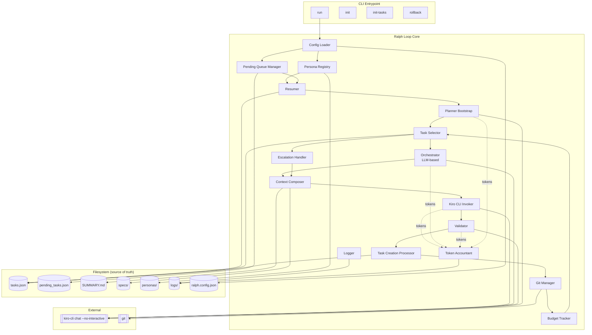
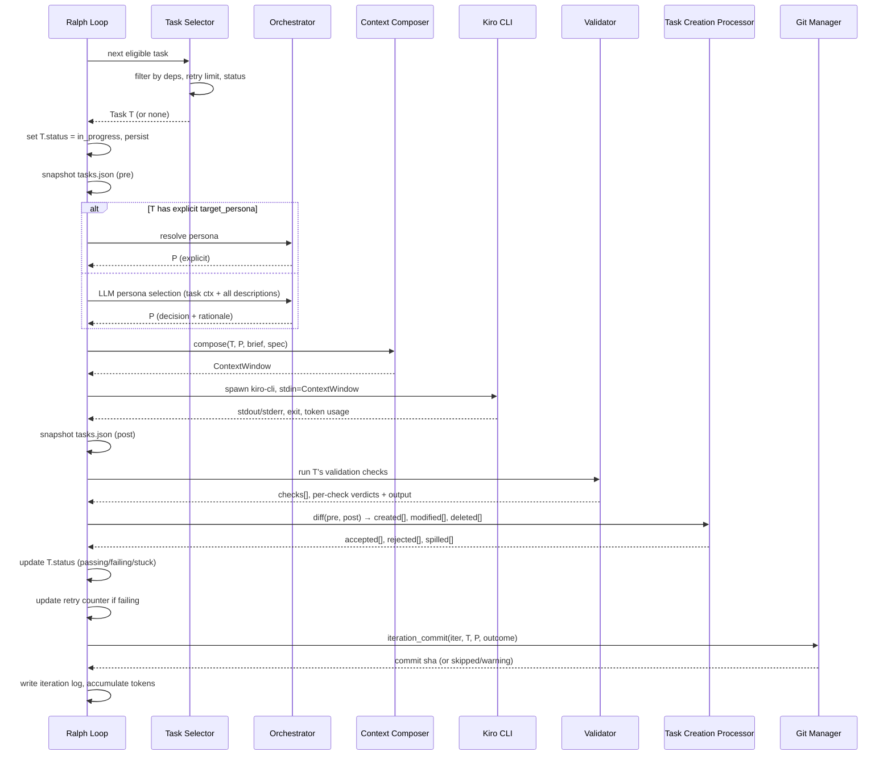
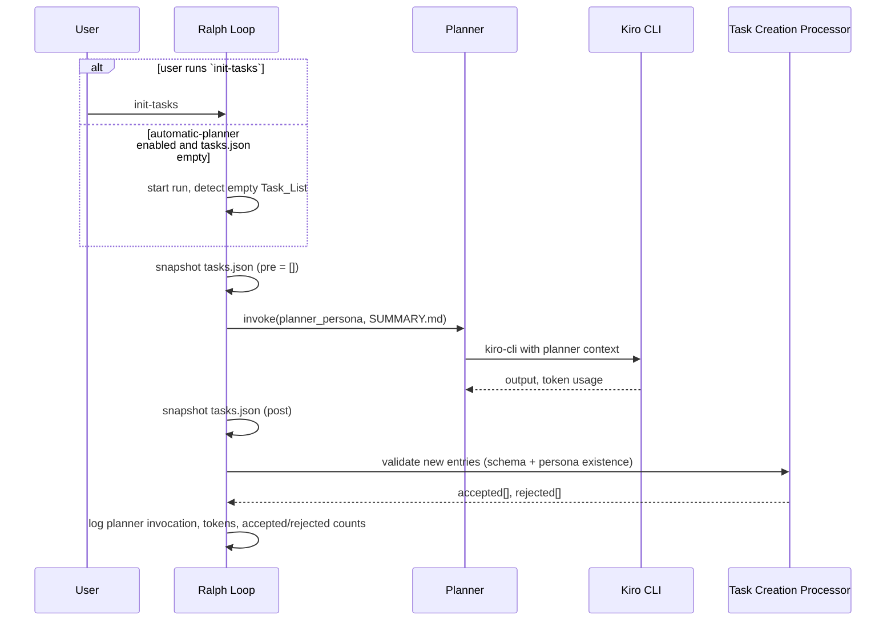
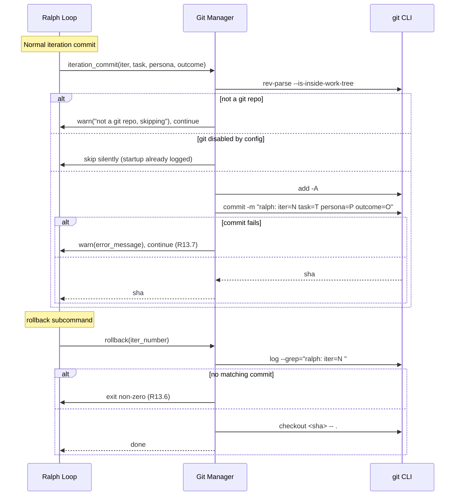

# Design Document: Ralph Loop

## Overview

The Ralph Loop is a domain-agnostic orchestration wrapper around Kiro CLI (`kiro-cli chat --no-interactive`). Each "iteration" is a fresh, short-lived agent session that works on exactly one Task under exactly one Persona. Between iterations, the Ralph Loop owns the state: it reads and writes `tasks.json`, per-task spec files in `specs/`, persona definitions in `personas/`, the `SUMMARY.md` project brief, the `pending_tasks.json` queue, and per-iteration logs under `logs/`. Git acts as an append-only audit trail of working-tree changes, with a `rollback` subcommand that returns the repo to any prior iteration.

The design is built around three observations that fall out of the requirements:

1. **The filesystem is the single source of truth.** Nothing important is kept in memory across iterations. Resumability (R14), dynamic task creation (R8), and pending-queue re-admission (R9) are all filesystem diffs, not in-memory state transitions.
2. **The Orchestrator is itself an LLM call.** Persona selection (R4) is a single structured LLM call that reasons over persona descriptions. It is not rule-based, it has defined failure modes (hallucination, network error, unparseable response), and it emits token usage like every other call (R12).
3. **Personas can mutate `tasks.json` out-of-band.** Dynamic task creation (R8) is detected by diffing the pre- and post-iteration states of `tasks.json`, which means the Ralph Loop must own the serialization barrier and must validate, normalize, revert unauthorized edits, and budget-limit new tasks after every iteration.

The first concrete use case is authoring a non-fiction technical book (Writer, Reviewer, Editor, Fact-Checker, Outline, Planner personas), but nothing in the loop is book-specific. The same architecture handles code, research reports, and data pipelines just by swapping the persona registry and the validation checks.

### Language and runtime

**Recommendation: Python 3.11+ with Pydantic v2.**

Justification, briefly:

- **Strong schema-backed types for many small data models.** Tasks, Task Specs, Personas, Config, iteration logs, token usage records, and pending-queue entries each have schemas (R2, R3, R18, R12, R15). Pydantic v2 `BaseModel` lets the schema, the runtime validator, and the static type share one definition. Combined with `mypy` or `pyright` for static checks, this eliminates a class of "the JSON says X but the code reads Y" bugs that map directly to "mark the Task as stuck and log an error" acceptance criteria. Pydantic also produces JSON Schema directly (`Model.model_json_schema()`), which is convenient for documenting the file formats.
- **First-class subprocess and streaming.** The core inner operation is "spawn `kiro-cli`, pipe a composed prompt on stdin, capture stdout/stderr/exit code." Python's `asyncio.create_subprocess_exec` (or `subprocess.Popen` for a synchronous variant) handles this cleanly, including stream-to-file teeing for R11.5 ("write all log output to both log files and stdout concurrently").
- **Mature PBT library.** `hypothesis` has strategies (`st.builds`, `st.lists`, `st.sampled_from`, `st.composite`), shrinking, stateful testing, and async support that are a close match to the properties in this spec (task selection eligibility, cycle detection, diff-based task creation, pending-queue round-trips). `@given`, `@example`, and the `Phase.shrink` machinery map cleanly to the property list.
- **CLI ergonomics.** `click` or `typer` covers the subcommand surface (`run`, `init`, `init-tasks`, `rollback`) with consistent help text and argument parsing. `typer` builds on `click` and gets type-hint-driven parsing for free, which pairs well with Pydantic-backed config.
- **YAML frontmatter parsing.** `PyYAML` (`yaml.safe_load`) handles Task_Spec and Persona frontmatter; `ruamel.yaml` is available if we need round-trip preservation of comments or ordering. Frontmatter extraction itself is a small regex over the leading `---` delimiters.
- **Git integration.** Either direct `subprocess` invocations of the `git` binary or `GitPython` for a typed wrapper. The direct-subprocess approach is preferred here: it keeps the dependency footprint small, avoids a heavyweight library for the handful of commands we actually use (`rev-parse`, `add`, `commit`, `log --grep`, `checkout`), and mirrors the same pattern we already use for Kiro CLI. `GitPython` remains a reasonable option if we later need richer repo inspection.
- **Structured logging.** `structlog` with a JSON renderer, or the stdlib `logging` module configured with `python-json-logger`, produces the per-iteration NDJSON stream and the tee-to-stdout behavior required by R11.

The two choices (Python vs Node.js) are near-equivalent on raw capability. Python is preferred here for the combination of Pydantic's schema ergonomics, `hypothesis`'s depth as a property-based testing tool, and the smaller dependency surface for the subprocess-heavy workload this loop does.

### Packaging

- `pyproject.toml` with a modern build backend (`hatchling` or `setuptools>=61`).
- Dependencies managed with `uv` (preferred) or `pip`; `uv sync` / `uv lock` for reproducible envs.
- Installed as a console script entry point:

  ```toml
  [project.scripts]
  ralph = "ralph_loop.cli:main"
  ```

- Module layout rooted at `ralph_loop/` with submodules for each component (`cli.py`, `config.py`, `persona_registry.py`, `task_selector.py`, `orchestrator.py`, `context.py`, `kiro.py`, `validator.py`, `task_creation.py`, `git_manager.py`, `logger.py`, `tokens.py`, `planner.py`, `resumer.py`, `pending_queue.py`, `budget.py`, `models.py`).

## Architecture

### High-level diagram



### Normal iteration sequence



### Escalation flow

```mermaid
sequenceDiagram
    participant L as Ralph Loop
    participant TS as Task Selector
    participant EH as Escalation Handler
    participant CC as Context Composer
    participant K as Kiro CLI

    L->>TS: next eligible task
    TS-->>L: Task T with retry_count == escalation_threshold
    L->>EH: route(T)
    alt escalation_persona configured
        EH-->>L: P = escalation_persona
        L->>L: log escalation_event(T, retry_count, P)
        L->>CC: compose with retry history + prior validation failures + prior iteration logs
    else no escalation persona
        EH-->>L: use normal selection
        L->>L: log escalation_event(T, retry_count, "none configured")
    end
    CC-->>L: ContextWindow (escalation-enriched)
    L->>K: spawn kiro-cli
    Note over L,K: Iteration proceeds as normal;<br/>retry limit still applies
```

### Planner bootstrap sequence



### Resumption on startup

```mermaid
sequenceDiagram
    participant L as Ralph Loop
    participant R as Resumer
    participant PQ as Pending Queue Manager
    participant TS as Task Selector

    L->>L: load config
    L->>L: load persona registry (fail-fast on duplicates / missing fields)
    L->>R: scan tasks.json
    R->>R: for each task with status in_progress:<br/>set status=failing, DO NOT increment retry
    R->>R: mark resumed_from_interruption flag on those tasks
    R->>R: detect cycles in depends_on; mark cycle participants stuck
    R->>R: detect missing depends_on targets; mark referrers stuck
    R-->>L: reset_count, reset_ids[]
    L->>L: log "reset N interrupted tasks: [...]"
    L->>PQ: process pending_tasks.json
    PQ->>PQ: load, validate each entry (schema + persona)
    PQ->>PQ: admit accepted, discard rejected (logged)
    PQ->>PQ: truncate pending_tasks.json
    PQ-->>L: loaded, admitted, discarded counts
    L->>L: log queue processing summary
    alt tasks.json empty
        alt automatic-planner enabled
            L->>L: invoke planner (see Planner sequence)
        else
            L->>L: log "run `init-tasks`", exit non-zero
        end
    end
    L->>TS: begin normal iteration loop
```

### Task-creation-event processing (post-iteration)

```mermaid
sequenceDiagram
    participant L as Ralph Loop
    participant TCP as Task Creation Processor
    participant BT as Budget Tracker

    L->>TCP: diff(pre_snapshot, post_snapshot, executing_task_id)
    TCP->>TCP: classify entries: created[], modified[], deleted[]
    loop for each modified/deleted non-executing task
        TCP->>TCP: revert to pre state
        TCP->>TCP: log warning(iter, task_id, persona)
    end
    loop for each created task
        TCP->>TCP: validate schema (R2)
        TCP->>TCP: validate target_persona exists (R8.7)
        TCP->>TCP: validate creation-chain depth (R8.12)
        alt invalid
            TCP->>TCP: reject (do NOT spill to queue), log
        else valid
            TCP->>BT: admit?
            alt per-iteration budget exceeded
                BT-->>TCP: spill
                TCP->>TCP: append to pending_tasks.json with creation + spill metadata
            else per-run budget exceeded
                BT-->>TCP: spill (rest of run)
                TCP->>TCP: append to pending_tasks.json
            else admit
                BT-->>TCP: admit
                TCP->>TCP: stamp created_at_iteration + created_by_persona
                TCP->>TCP: write accepted entry to tasks.json
            end
        end
    end
    TCP->>TCP: detect cycles after all accepted entries merged; mark participants stuck
    TCP-->>L: accepted[], rejected[], spilled[], reverted[]
```

### Git commit and rollback




## Components and Interfaces

Each component is a small module with a narrow interface. Python signatures below use type hints, Pydantic `BaseModel` for data, and `typing.Protocol` (structural typing) or `abc.ABC` for component interfaces. All modules return structured results; errors are values, not raised exceptions, except for fail-fast startup violations.

Throughout this section, `Task`, `TaskSpec`, `Persona`, `Config`, `TokenUsage`, `LlmCallRecord`, `CheckResult`, and related types are the Pydantic models defined in the **Data Models** section below.

### Config Loader

```python
from typing import Protocol, Optional
from ralph_loop.models import Config, CliArgs


class ConfigLoader(Protocol):
    def load(self, cli_args: CliArgs, config_path: Optional[str] = None) -> Config:
        ...
```

- Merges defaults < `ralph.config.json` < CLI args (R15.2).
- Resolves all file paths to absolute paths relative to the project root.
- Fail-fast (R15.9) if a required file (tasks.json, SUMMARY.md, persona dir) is missing.
- Defaults: pending queue = `pending_tasks.json` (R15.5), git integration enabled (R15.6), automatic planner disabled (R15.7), max iterations 50 (R10.1), max retries 5 (R10.2), wall-clock 60min (R10.4), per-iter creation budget 10 (R10.6), per-run creation budget 100 (R10.7), max creation-chain depth 5 (R10.8), escalation threshold 3 (R5.5).
- Defaults live on the `Config` Pydantic model via `Field(default=...)`; file values and CLI overrides are applied via `Config.model_copy(update=...)`.
- Relates to: R15 (all), R10 (defaults), R14.1.

### Persona Registry

```python
from typing import Protocol
from ralph_loop.models import Persona, PersonaDescription


class PersonaRegistry(Protocol):
    def load(self, directory: str) -> dict[str, Persona]: ...
    def get(self, name: str) -> Optional[Persona]: ...
    def all(self) -> list[Persona]: ...
    def describe_all_for_orchestrator(self) -> list[PersonaDescription]:
        """Return name + description only, as the Orchestrator prompt input."""
```

- Reads every file in `personas/` (R3.1).
- Parses each file (YAML or Markdown + frontmatter) into a `Persona` via Pydantic validation (R3.2).
- Fails on duplicate names (R3.5) or missing required fields (R3.6); Pydantic's `ValidationError` is caught and re-raised as a descriptive fail-fast error.
- Exposes the description set used by the Orchestrator (R3.8, R4.2).

### Pending Queue Manager

```python
from typing import Protocol
from pydantic import BaseModel
from ralph_loop.models import Task, SpillReason


class PendingQueueResult(BaseModel):
    loaded: int
    admitted: list[Task]
    discarded: list["DiscardedEntry"]


class DiscardedEntry(BaseModel):
    raw_entry: dict
    reason: str


class PendingQueueManager(Protocol):
    def process_on_startup(self) -> PendingQueueResult: ...
    def spill(self, task: Task, reason: SpillReason, run_id: str) -> None: ...
```

- On startup, loads `pending_tasks.json`, validates each entry against the `Task` Pydantic model (R2) and persona existence (R3), admits valid entries to `tasks.json`, discards and logs invalid ones, then truncates the file (R9.1–R9.11).
- Admitted tasks preserve original creation metadata and gain `spilled_run_id` and `admitted_run_id` fields (R9.7).
- Admitted tasks do NOT count against the current run's creation budget (R9.8).
- Fail-fast on unparseable pending queue JSON (R9.11): a `json.JSONDecodeError` caught at load is reported with the file path and original error.
- During a run, `spill(task, reason, run_id)` appends surplus created tasks when the Task Creation Processor determines a budget was exceeded (R8.10, R8.11, R8.13).
- Relates to: R9 (all), R8.10, R8.11, R8.13.

### Resumer

```python
from typing import Protocol
from pydantic import BaseModel
from ralph_loop.models import Task


class ResumeResult(BaseModel):
    reset_tasks: list[Task]                       # those reset from in_progress to failing
    stuck_by_missing_dep: list[Task]
    stuck_by_cycle_tasks: list[Task]
    detected_cycle: list[str]                     # ordered task ids forming the cycle


class Resumer(Protocol):
    def resume(self, tasks: list[Task]) -> ResumeResult: ...
```

- Resets `in_progress` tasks to `failing` without incrementing retry counter (R14.3, R14.4).
- Tags each reset task with `resumed_from_interruption = True` so the Context Composer can add the notice (R14.5).
- Runs cycle detection (R2.10, R2.11) and missing-dependency detection (R2.9) before the first iteration.
- Logs reset count and IDs (R14.6).

### Task Selector

```python
from typing import Protocol, Optional
from ralph_loop.models import Task, Config


class TaskSelector(Protocol):
    def next(self, tasks: list[Task], config: Config) -> Optional[Task]: ...
```

- Applies eligibility: `status` in `{"pending", "failing"}` AND `retry_count < config.max_retries_per_task` AND every id in `depends_on` references an existing task whose status is `"passing"` (R2.7, R2.8).
- Sorts eligible tasks by ascending `priority` (R2.7) and returns the head.
- Returns `None` when no task is eligible. The outer loop then decides termination (R1.6: all passing → success; R1.8: all remaining blocked or stuck → failure).
- Pure function; no I/O. This is the primary PBT target.

### Orchestrator

```python
from typing import Protocol, Optional, Literal
from pydantic import BaseModel
from ralph_loop.models import Task, TaskSpec, Persona, PersonaRegistry, TokenUsage


class PersonaSelection(BaseModel):
    persona: Persona
    path: Literal["explicit", "llm", "fallback", "escalation"]
    rationale: Optional[str] = None
    llm_decision_raw: Optional[str] = None
    token_usage: Optional[TokenUsage] = None


class Orchestrator(Protocol):
    def select_persona(
        self,
        task: Task,
        spec: TaskSpec,
        registry: PersonaRegistry,
    ) -> PersonaSelection: ...
```

- If task has an explicit `target_persona` present in the registry → use it (R4.1).
- If the explicit target is missing from the registry → mark the task stuck, do NOT call the LLM (R4.9).
- Otherwise invoke a single structured LLM call with task context + every persona's name and description (R4.2, R4.3, R3.8).
- The LLM is instructed to return strict JSON parsed into an `OrchestratorDecision` Pydantic model: `{"persona": "<name>", "rationale": "<text>"}` (R4.4). Pydantic validates shape; failures are treated as parse errors.
- Unparseable or network-failed call → fallback persona, log warning (R4.8). The Orchestrator makes exactly one attempt per iteration with no retry; if the single call fails for any reason (network, timeout, parse error), the fallback persona is used immediately. Retries are unnecessary because each iteration is independent — the next iteration that needs LLM-based selection will make a fresh attempt.
- Hallucinated persona name → mark task stuck (R4.7).
- Log the full decision (R4.6) and selection path (R4.10).
- Token usage recorded for call kind `orchestrator_selection` (R12.1, R12.2).

### Escalation Handler

```python
from typing import Protocol
from ralph_loop.models import Task, PersonaRegistry, Config, IterationLog


class EscalationHandler(Protocol):
    def should_escalate(self, task: Task, config: Config) -> bool: ...
    def route(
        self,
        task: Task,
        registry: PersonaRegistry,
        config: Config,
    ) -> PersonaSelection: ...
    def build_escalation_context(
        self,
        task: Task,
        logs: list[IterationLog],
    ) -> str: ...
```

- `should_escalate` is `True` when `task.retry_count >= config.escalation_threshold` (R5.1).
- If escalation persona is configured, returns it with `path="escalation"` (R5.2).
- If not configured, delegates back to the Orchestrator (R5.4).
- Builds supplemental context from prior failing validation outputs and iteration logs for the same task (R5.3).
- Logs the escalation event (R5.7).
- The retry limit still terminates the task as stuck when retries run out (R5.6, R10.3).

### Context Composer

```python
from typing import Protocol, Optional, Literal
from pydantic import BaseModel
from ralph_loop.models import Task, TaskSpec, Persona


class ContextWindow(BaseModel):
    text: str
    approx_tokens: int
    truncated: bool


class ContextComposer(Protocol):
    def compose(
        self,
        *,
        task: Task,
        spec: TaskSpec,
        persona: Persona,
        brief: str,
        selection_path: Literal["explicit", "llm", "fallback", "escalation"],
        escalation_context: Optional[str] = None,
        resumed_notice: bool = False,
    ) -> ContextWindow: ...
```

- Produces a single prompt string for Kiro CLI stdin.
- Sections, in order:
  1. Loop framing (R6.6).
  2. Resumed-from-interruption notice, if applicable (R14.5).
  3. Project brief (R6.2).
  4. Task spec, including referenced context files inlined (R18.5, R18.6).
  5. Persona prompt template with placeholders substituted (R3.7, R6.4).
  6. Persona instructions (R6.5).
  7. Escalation context if present (R5.3).
- Truncation rule on token-budget overflow: keep full Task Spec and full Persona prompt + instructions; truncate Project Brief to its summary section (R6.7).
- Supported placeholders: `{{project_brief}}`, `{{task_spec}}`, `{{task_id}}`, `{{task_title}}`, `{{persona_name}}` (R3.7).

### Kiro CLI Invoker

```python
from typing import Protocol, Optional, Literal
from pydantic import BaseModel
from ralph_loop.models import TokenUsage


CallKind = Literal[
    "persona_execution",
    "orchestrator_selection",
    "persona_review",
    "planner",
    "escalation",
]
```

**CallKind selection rule:** When the Kiro CLI Invoker is called for a persona iteration, the `call_kind` is determined by the selection path that produced the persona:
- `selection_path == "escalation"` → `call_kind = "escalation"`
- All other selection paths (`"explicit"`, `"llm"`, `"fallback"`) → `call_kind = "persona_execution"`

This means an escalated iteration — even though it invokes a persona — records its token usage under `"escalation"`, not `"persona_execution"`. This distinction allows the Token Accountant to report escalation cost separately in the run summary.


class KiroInvocationResult(BaseModel):
    exit_code: int
    stdout: str
    stderr: str
    token_usage: Optional[TokenUsage] = None   # None if not reported
    duration_ms: int


class KiroInvoker(Protocol):
    async def invoke(
        self,
        *,
        call_kind: CallKind,
        context: str,
        cwd: str,
        timeout_ms: Optional[int] = None,
    ) -> KiroInvocationResult: ...
```

- Spawns `kiro-cli chat --no-interactive` as a child process via `asyncio.create_subprocess_exec`, pipes the composed context on stdin, and streams stdout/stderr concurrently to both a per-iteration log file and process stdout (R11.2, R11.5). Stream teeing uses two `asyncio.Task`s reading from `proc.stdout` and `proc.stderr` line-by-line.
- Each iteration is a brand-new session; no state is carried across invocations (R6.1).
- Parses token usage from Kiro CLI's structured output envelope via a dedicated Pydantic model; when the envelope is absent, emits a warning and records no token data (R12.6).

### Validator

```python
from typing import Protocol, Optional, Literal
from pydantic import BaseModel
from ralph_loop.models import Task, TaskSpec, Config


Verdict = Literal["pass", "fail"]
CheckType = Literal["shell", "persona_review", "file_exists"]


class CheckResult(BaseModel):
    type: CheckType
    name: str
    verdict: Verdict
    output: str
    rationale: Optional[str] = None              # persona_review
    resolved_pass_condition: Optional[str] = None  # persona_review
    reviewing_persona: Optional[str] = None      # persona_review
    duration_ms: int
    timed_out: bool = False


class ValidationResult(BaseModel):
    overall: Verdict
    checks: list[CheckResult]
    timed_out_checks: list[str]


class Validator(Protocol):
    async def run(
        self,
        task: Task,
        spec: TaskSpec,
        config: Config,
    ) -> ValidationResult: ...
```

- `shell`: runs commands (via `asyncio.create_subprocess_exec`), passes iff every command exits 0 (R7.2, R7.5).
- `file_exists`: passes iff every path exists via `pathlib.Path.exists()` (R7.4, R7.11).
- `persona_review`:
  1. Resolve pass condition (spec override > persona default > stuck + error) (R7.6, R7.7, R7.8).
  2. Invoke reviewing persona in a separate Kiro CLI session with task artifacts + resolved pass condition (R7.9).
  3. Parse structured verdict via Pydantic: `{"verdict": "pass" | "fail", "rationale": "..."}` (R7.9).
  4. Log reviewing persona name, pass condition, verdict, rationale (R7.10).

  **Recursion safety:** The reviewing persona's Kiro CLI session is invoked with a context that contains only the task artifacts and the pass condition — it does not include loop-framing instructions, does not have write access to `tasks.json`, and does not itself trigger validation checks. This means a `persona_review` session cannot spawn further reviews or create tasks, eliminating the risk of infinite recursion. As an additional guard, the Validator will not invoke a `persona_review` check whose reviewing persona name matches the persona that executed the current iteration (self-review is a configuration error); if detected, the check is marked as failing with a logged error identifying the self-referencing persona.
- Per-check timeout (R7.13) enforced via `asyncio.wait_for`.
- Any failing check → overall `fail` → executing task marked `failing` and retry incremented (R2.6, R7.12).

### Task Creation Processor

```python
from typing import Protocol, Any
from pydantic import BaseModel
from ralph_loop.models import Task


class RejectedEntry(BaseModel):
    entry: dict[str, Any]
    reason: str


class RevertedEntry(BaseModel):
    task_id: str
    reason: Literal["modified", "deleted"]


class TaskCreationResult(BaseModel):
    accepted: list[Task]
    rejected: list[RejectedEntry]
    reverted: list[RevertedEntry]
    spilled: list[Task]
    cycle_stuck: list[str]


class TaskCreationProcessor(Protocol):
    def process(
        self,
        *,
        pre_snapshot: list[Task],
        post_snapshot: list[dict[str, Any]],   # raw dicts; not yet validated
        executing_task_id: str,
        executing_persona: str,
        iteration_number: int,
        run_id: str,
    ) -> TaskCreationResult: ...
```

- Diffs pre and post snapshots of `tasks.json` (R8.2).
- Any modification or deletion of a non-executing task is reverted (R8.8).
- New entries are validated against the `Task` Pydantic model (R8.4) and persona existence (R8.7).
- Creation-chain depth check: reject if depth > max (R8.12, R10.8).
- Budget enforcement: per-iteration (R8.10) and per-run (R8.11); surplus is spilled to pending queue preserving creation + spill metadata (R8.13).
- After merging accepted entries into `tasks.json`, re-run cycle detection (R2.10, R2.11).
- Validation failures (schema or missing persona) are NOT spilled (R8.4, R8.7); they are rejected and logged.

### Budget Tracker

```python
from typing import Protocol


class BudgetTracker(Protocol):
    def can_create_this_iteration(self) -> bool: ...
    def can_create_this_run(self) -> bool: ...
    def record_created(self, n: int) -> None: ...
    def check_wall_clock(self) -> bool: ...
    def record_iteration(self) -> bool:
        """Return False if the per-run iteration cap has been reached."""
```

- Tracks per-run task-creation count (R10.7), per-iteration count (R10.6), total iterations (R10.1), wall-clock (R10.4).
- Pure in-memory counters; reset for each run.
- Admitted pending-queue tasks do not call `record_created` (R9.8).

### Git Manager

```python
from typing import Protocol, Optional, Literal
from pydantic import BaseModel


class CommitResult(BaseModel):
    sha: Optional[str] = None
    skipped: bool = False
    skip_reason: Optional[Literal["disabled", "not-a-repo", "error"]] = None
    error: Optional[str] = None


class GitManager(Protocol):
    async def iteration_commit(
        self,
        *,
        iteration: int,
        task_id: str,
        persona: str,
        outcome: Literal["pass", "fail", "stuck", "escalated", "timeout"],
    ) -> CommitResult: ...
    async def rollback(self, iteration: int) -> None: ...
    def is_enabled(self) -> bool: ...
    async def is_git_repo(self) -> bool: ...
```

- Commit message format: `ralph: iter=<N> task=<id> persona=<name> outcome=<outcome>` (R13.2).
- No-op with warning if not a git repo (R13.3).
- No-op with startup log line if disabled (R13.4).
- Git errors logged but non-fatal (R13.7).
- Rollback resolves iteration → commit by grepping the iteration number in commit messages (R13.5); missing commit → non-zero exit (R13.6).
- Implemented via direct `subprocess`/`asyncio.create_subprocess_exec` invocations of `git`. `GitPython` is a viable alternative wrapper if we later need richer repo inspection.

### Logger

```python
from typing import Protocol, Optional, Any
from ralph_loop.models import (
    IterationLogEntry,
    IterationOutcome,
    CallKind,
    TokenUsage,
    RunSummary,
)


class IterationLogWriter(Protocol):
    def record(self, entry: IterationLogEntry) -> None: ...
    def append_token_usage(
        self,
        kind: CallKind,
        usage: TokenUsage,
        model: Optional[str] = None,
    ) -> None: ...
    def finalize(self, outcome: IterationOutcome) -> None: ...


class Logger(Protocol):
    def iteration_log(self, iteration: int) -> IterationLogWriter: ...
    def run_summary(self, summary: RunSummary) -> None: ...
    def info(self, msg: str, ctx: Optional[dict[str, Any]] = None) -> None: ...
    def warn(self, msg: str, ctx: Optional[dict[str, Any]] = None) -> None: ...
    def error(self, msg: str, ctx: Optional[dict[str, Any]] = None) -> None: ...
```

- Backed by `structlog` (preferred) or stdlib `logging` with a JSON formatter.
- Tees to both file and stdout (R11.5) via a custom handler that writes to both sinks.
- Per-iteration log contains everything the requirements specify (R11.3, R12.2).
- Run summary contains totals (R11.4) including token/cost totals (R12.5).

### Token Accountant

```python
from typing import Protocol, Optional
from pydantic import BaseModel
from ralph_loop.models import CallKind


class LlmCallRecord(BaseModel):
    iteration: int
    kind: CallKind
    model: Optional[str] = None
    input_tokens: Optional[int] = None
    output_tokens: Optional[int] = None
    estimated_cost: Optional[float] = None   # only when pricing is configured


class KindTotals(BaseModel):
    input: int = 0
    output: int = 0
    cost: Optional[float] = None


class RunTokenTotals(BaseModel):
    total_input: int = 0
    total_output: int = 0
    total_combined: int = 0
    total_estimated_cost: Optional[float] = None
    by_kind: dict[CallKind, KindTotals] = {}


class TokenAccountant(Protocol):
    def record(self, call: LlmCallRecord) -> None: ...
    def totals(self) -> RunTokenTotals: ...
```

- Computes cost as `input_tokens * input_price + output_tokens * output_price` when the model is in `Model_Pricing` (R12.3); omits cost otherwise (R12.4).
- Records are aggregated into run totals for the summary log (R12.5).
- Calls missing token data are excluded from totals with a warning (R12.6).

### Planner

```python
from typing import Protocol, Any, Literal
from pydantic import BaseModel
from ralph_loop.models import Task, TokenUsage


class PlannerRejectedEntry(BaseModel):
    entry: dict[str, Any]
    reason: str


class PlannerResult(BaseModel):
    accepted: list[Task]
    rejected: list[PlannerRejectedEntry]
    token_usage: Optional[TokenUsage] = None


class Planner(Protocol):
    async def bootstrap(
        self,
        *,
        reason: Literal["init-tasks", "auto"],
    ) -> PlannerResult: ...
```

- Invoked via `init-tasks` subcommand (R17.2) or automatically when `tasks.json` is empty and the auto flag is set (R17.3).
- Runs exactly like a persona iteration but with a reserved call kind `planner` (R12).
- After the Planner's Kiro CLI session completes, the Planner delegates to `TaskCreationProcessor.process` with `pre_snapshot=[]` (the empty task list before the planner ran) and the post-iteration `tasks.json` as `post_snapshot`. This ensures the Planner's output goes through the exact same validation pipeline as in-iteration task creation: schema validation (R2), persona-existence checks (R8.7), creation-chain depth enforcement (R8.12), and budget limits (R8.10, R8.11). Using the same code path eliminates the risk of divergent validation behavior between planner-created and persona-created tasks.
- Invalid entries are rejected with logs (R17.6); valid entries are admitted to `tasks.json`.
- Missing planner persona → fatal error (R17.7).
- Empty task list without auto flag → informational message pointing to `init-tasks` + non-zero exit (R17.4).

### CLI Surface

The CLI is a `click` (or `typer`) application installed as a console script `ralph`:

```text
ralph run [--config <path>] [--...overrides]
ralph init [--template <name>]
ralph init-tasks
ralph rollback <iteration-number>
```

Sketch of the Click entry point:

```python
import click

@click.group()
def main() -> None:
    """Ralph Loop: domain-agnostic iteration wrapper for Kiro CLI."""


@main.command()
@click.option("--config", type=click.Path(exists=False), default=None)
# ...other overrides that map onto Config fields...
def run(config: str | None) -> None:
    """Run the Ralph Loop main iteration loop."""


@main.command()
@click.option("--template", default=None)
@click.option("--force", is_flag=True, default=False, help="Overwrite existing files without prompting.")
def init(template: str | None, force: bool) -> None:
    """Scaffold a new Ralph Loop project in the current directory."""


@main.command("init-tasks")
def init_tasks() -> None:
    """Invoke the Planner persona to generate the initial Task_List."""


@main.command()
@click.argument("iteration_number", type=int)
def rollback(iteration_number: int) -> None:
    """Revert the working tree to the commit for iteration N."""
```

- `run` is the default operational command. Executes the main loop.
- `init` scaffolds the project (R16.1–R16.7, R16.9). When existing Ralph Loop files are detected, the command prompts the user for confirmation before overwriting each file. In non-interactive contexts (CI, piped stdin), the `--force` flag skips all prompts and overwrites unconditionally. Without `--force` in a non-interactive context, the command exits with a non-zero code and a message directing the user to use `--force`.
- `init-tasks` invokes the Planner (R16.8, R17.2).
- `rollback <n>` reverts the working tree to the commit for iteration `n` (R13.5, R13.6).
- The entry point is wired via `pyproject.toml`:

  ```toml
  [project.scripts]
  ralph = "ralph_loop.cli:main"
  ```


## Data Models

All models are Pydantic v2 `BaseModel` classes. The Pydantic model is authoritative: it drives runtime validation on every file read, JSON Schema export via `Model.model_json_schema()`, and static typing via the type hints themselves (checked with `mypy` or `pyright`). Enum values are represented with `typing.Literal` or `enum.Enum` to keep the wire format as plain strings.

### Task (entry in `tasks.json`)

```python
from typing import Optional, Literal
from pydantic import BaseModel, Field, field_validator


TaskStatus = Literal["pending", "in_progress", "passing", "failing", "stuck"]


class Task(BaseModel):
    id: str = Field(..., min_length=1)                   # unique within tasks.json (R2.2)
    title: str = Field(..., min_length=1)                # human-readable
    priority: int                                        # lower = selected first (R2.7)
    status: TaskStatus                                   # R2.2
    spec_path: str = Field(..., min_length=1)            # relative to project root (R2.2)
    target_persona: Optional[str] = None                 # optional; else LLM-selected (R2.3/R2.4)
    depends_on: Optional[list[str]] = None               # optional; task IDs (R2.2)
    tags: Optional[list[str]] = None                     # passed to Orchestrator (R18.2, R4.3)
    retry_count: int = Field(default=0, ge=0)            # incremented on validation fail (R2.6)

    # Creation and provenance metadata
    created_at_iteration: Optional[int] = Field(default=None, ge=0)   # R8.5
    created_by_persona: Optional[str] = None                          # R8.5
    creation_chain: Optional[list[str]] = None                        # R8.12

    # Pending-queue provenance
    spilled_run_id: Optional[str] = None                 # R8.13, R9.7
    admitted_run_id: Optional[str] = None                # R9.7

    # Resumer flag (transient; not required to persist, but convenient)
    resumed_from_interruption: Optional[bool] = None     # R14.5

    @field_validator("retry_count")
    @classmethod
    def _retry_non_negative(cls, v: int) -> int:
        if v < 0:
            raise ValueError("retry_count must be >= 0")
        return v
```

JSON Schema (derived from the Pydantic model via `Task.model_json_schema()`, shown here informally for reference):

```json
{
  "type": "object",
  "required": ["id", "title", "priority", "status", "spec_path", "retry_count"],
  "properties": {
    "id": {"type": "string", "minLength": 1},
    "title": {"type": "string", "minLength": 1},
    "priority": {"type": "integer"},
    "status": {"enum": ["pending", "in_progress", "passing", "failing", "stuck"]},
    "spec_path": {"type": "string", "minLength": 1},
    "target_persona": {"type": "string"},
    "depends_on": {"type": "array", "items": {"type": "string"}},
    "tags": {"type": "array", "items": {"type": "string"}},
    "retry_count": {"type": "integer", "minimum": 0},
    "created_at_iteration": {"type": "integer", "minimum": 0},
    "created_by_persona": {"type": "string"},
    "creation_chain": {"type": "array", "items": {"type": "string"}},
    "spilled_run_id": {"type": "string"},
    "admitted_run_id": {"type": "string"}
  }
}
```

`tasks.json` is a top-level array of `Task` objects, deserialized via `TypeAdapter(list[Task]).validate_json(raw_bytes)`.

### Task Spec (`specs/<id>.md`)

Markdown with YAML frontmatter (R18.1). The frontmatter is parsed with `yaml.safe_load`, then validated into the Pydantic models below.

```markdown
---
id: ch-02-draft
title: Draft Chapter 2
target_persona: Writer          # optional (R18.2)
tags: [chapter, draft]          # optional (R18.2)
depends_on: [outline-v1]        # optional (R18.2)
persona_fields:                 # optional, per-persona config (R18.2)
  tone: plain
  audience: intermediate
validation:
  - type: file_exists
    paths: ["book/ch-02.md"]
  - type: persona_review
    persona: Reviewer
    pass_condition: "no critical issues"
  - type: shell
    commands: ["markdownlint book/ch-02.md"]
context_files:                  # optional (R18.5)
  - book/outline.md
  - book/style-guide.md
---

## Objective
...

## Context References
...

## Instructions
...

## Notes
...
```

Python parsed form:

```python
from typing import Annotated, Literal, Optional, Union, Any
from pydantic import BaseModel, Field


class ShellCheckConfig(BaseModel):
    type: Literal["shell"]
    name: Optional[str] = None
    commands: list[str] = Field(..., min_length=1)
    timeout_ms: Optional[int] = Field(default=None, ge=0)


class PersonaReviewCheckConfig(BaseModel):
    type: Literal["persona_review"]
    name: Optional[str] = None
    persona: str
    pass_condition: Optional[str] = None
    timeout_ms: Optional[int] = Field(default=None, ge=0)


class FileExistsCheckConfig(BaseModel):
    type: Literal["file_exists"]
    name: Optional[str] = None
    paths: list[str] = Field(..., min_length=1)


ValidationCheckConfig = Annotated[
    Union[ShellCheckConfig, PersonaReviewCheckConfig, FileExistsCheckConfig],
    Field(discriminator="type"),
]


class TaskSpecBody(BaseModel):
    objective: str
    context_references: str
    instructions: str
    notes: Optional[str] = None


class TaskSpec(BaseModel):
    id: str
    title: str
    target_persona: Optional[str] = None
    tags: Optional[list[str]] = None
    depends_on: Optional[list[str]] = None
    persona_fields: Optional[dict[str, Any]] = None
    validation: list[ValidationCheckConfig] = Field(..., min_length=1)
    context_files: Optional[list[str]] = None
    body: TaskSpecBody
```

Invariants (R18.7):
- Frontmatter must have `id`, `title`, `validation`. Pydantic raises `ValidationError` otherwise.
- Each `validation` entry must have a valid `type` and its required type-specific fields. The discriminated union (`Field(discriminator="type")`) enforces this at parse time.
- Missing or invalid → task marked `stuck` + error log (the `ValidationError` is caught at the boundary and converted into a stuck-task marking).

### Persona (file in `personas/`)

Either YAML or Markdown with frontmatter. Example YAML:

```yaml
name: Reviewer                    # required (R3.2)
description: |                    # required (R3.2, R3.3)
  Reviews drafted chapters for clarity, structure, and factual consistency.
  Use this persona to give editorial verdicts on written material.
prompt_template: |                # required (R3.2)
  You are the Reviewer for "{{task_title}}" ({{task_id}}).
  Project brief:
  {{project_brief}}

  Task spec:
  {{task_spec}}

  Produce a structured review.
instructions: |                   # optional (R3.2)
  - Focus on structural issues first.
  - Flag factual claims that need verification.
tool_restrictions:                # optional (R3.2)
  disallow: ["shell"]
default_persona_review_pass_condition: "no critical issues or gaps"  # optional (R3.2, R7.7)
```

Parsed form:

```python
from typing import Optional
from pydantic import BaseModel


class ToolRestrictions(BaseModel):
    allow: Optional[list[str]] = None
    disallow: Optional[list[str]] = None


class Persona(BaseModel):
    name: str
    description: str
    prompt_template: str
    instructions: Optional[str] = None
    tool_restrictions: Optional[ToolRestrictions] = None
    default_persona_review_pass_condition: Optional[str] = None


class PersonaDescription(BaseModel):
    """Subset passed to the Orchestrator for LLM-based selection (R3.8, R4.2)."""
    name: str
    description: str
```

### Config (`ralph.config.json`)

```python
from typing import Optional
from pydantic import BaseModel, Field


class ModelPrice(BaseModel):
    input_price_per_token: float = Field(..., ge=0)
    output_price_per_token: float = Field(..., ge=0)


class Config(BaseModel):
    # Paths (R15.3)
    tasks_path: str = "tasks.json"
    summary_path: str = "SUMMARY.md"
    personas_dir: str = "personas/"
    specs_dir: str = "specs/"
    pending_tasks_path: str = "pending_tasks.json"       # R15.5
    log_dir: str = "logs/"

    # Personas (R15.3)
    fallback_persona: str
    escalation_persona: Optional[str] = None
    escalation_threshold: int = Field(default=3, ge=0)   # R5.5
    planner_persona: Optional[str] = None
    automatic_planner: bool = False                       # R15.7

    # Orchestrator (R15.3, R15.4)
    orchestrator_llm_command: Optional[str] = None        # falls back to kiro_cli_command
    orchestrator_model_id: Optional[str] = None

    # Loop (R15.3, R10)
    max_iterations: int = Field(default=50, ge=1)         # R10.1
    max_retries_per_task: int = Field(default=5, ge=1)    # R10.2
    wall_clock_timeout_ms: int = Field(default=60 * 60 * 1000, ge=0)  # R10.4
    validation_timeout_ms: int = Field(default=5 * 60 * 1000, ge=0)   # R7.13

    # Kiro CLI (R15.3)
    kiro_cli_command: str = "kiro-cli"

    # Task Creation Budgets (R10.6, R10.7, R10.8)
    per_iteration_task_creation_budget: int = Field(default=10, ge=0)
    per_run_task_creation_budget: int = Field(default=100, ge=0)
    max_creation_chain_depth: int = Field(default=5, ge=0)

    # Context (R6.7)
    max_context_tokens: int = Field(default=32_000, ge=1)

    # Git (R15.3, R15.6)
    git_integration_enabled: bool = True

    # Observability (R15.3)
    model_pricing: dict[str, ModelPrice] = {}
```

Pydantic's `BaseModel` (or `pydantic_settings.BaseSettings` if we later want env-var overrides) handles validation on load. CLI overrides are applied as `config.model_copy(update=cli_overrides)` after file parse.

### Iteration Log Entry

One JSON object per iteration, plus an NDJSON stream of finer-grained events appended during the iteration.

```python
from typing import Optional, Literal
from pydantic import BaseModel


IterationOutcome = Literal["pass", "fail", "stuck", "escalated", "timeout"]
SelectionPath = Literal["explicit", "llm", "fallback", "escalation"]


class ContextSummary(BaseModel):
    approx_tokens: int
    truncated: bool
    resumed_from_interruption: bool                       # R14.5
    escalation_enriched: bool                             # R5.3


class KiroInvocationLog(BaseModel):
    exit_code: int
    duration_ms: int
    stdout_path: str                                      # log file path
    stderr_path: str


class ValidationLog(BaseModel):
    overall: Literal["pass", "fail"]
    checks: list[CheckResult]


class TaskCreationEventLog(BaseModel):
    accepted_count: int
    rejected_count: int
    spilled_count: int
    reverted_ids: list[str]


class GitCommitLog(BaseModel):
    sha: Optional[str] = None
    skipped: bool
    skip_reason: Optional[str] = None


class IterationLogEntry(BaseModel):
    iteration: int
    run_id: str
    start_time: str                                       # ISO-8601
    end_time: str

    task_id: str
    persona_name: str
    selection_path: SelectionPath
    orchestrator_rationale: Optional[str] = None          # when selection_path == 'llm' (R4.6, R11.3)

    context_summary: ContextSummary
    kiro_invocation: KiroInvocationLog
    validation: ValidationLog

    task_creation_event: Optional[TaskCreationEventLog] = None

    llm_calls: list[LlmCallRecord]                        # R12.2
    outcome: IterationOutcome                             # R11.3

    git_commit: Optional[GitCommitLog] = None
```

### Token Usage Record

```python
from typing import Optional
from pydantic import BaseModel


class TokenUsage(BaseModel):
    input_tokens: int
    output_tokens: int
    model: Optional[str] = None


# LlmCallRecord is defined above in the Token Accountant section;
# it references CallKind and is the persisted form of each LLM call.
```

### Pending Task Queue (`pending_tasks.json`)

Top-level array of `Task` objects with `spilled_run_id` set and `admitted_run_id` absent. On load, passing entries are moved into `tasks.json`, gain `admitted_run_id`, and the queue file is truncated to `[]` (R9.7, R9.9). Deserialization uses `TypeAdapter(list[Task]).validate_json(raw)`; unparseable JSON raises a fatal startup error (R9.11).

### Run Summary

```python
from pydantic import BaseModel


class RunSummary(BaseModel):
    run_id: str                          # UUID4, generated once at the start of each `ralph run` invocation
    total_iterations: int
    status_counts: dict[TaskStatus, int]
    total_new_tasks: int
    escalation_events: int
    elapsed_ms: int
    token_totals: RunTokenTotals
    exit_code: int
```


## Correctness Properties

*A property is a characteristic or behavior that should hold true across all valid executions of a system — essentially, a formal statement about what the system should do. Properties serve as the bridge between human-readable specifications and machine-verifiable correctness guarantees.*

The Ralph Loop contains many components that are pure functions over structured data: task selection, dependency analysis, validation-result aggregation, diff-based task-creation detection, budget arithmetic, pending-queue round-trips, context composition, config merging, token accounting, and cost computation. Those components are the primary targets of property-based testing. Kiro CLI, git, and filesystem I/O are covered by integration tests instead (see Testing Strategy).

Each property below consolidates redundant acceptance criteria identified during prework reflection so that each property provides unique validation value.

### Property 1: Task Selector picks a minimum-priority eligible task

*For any* `tasks: list[Task]` and `config: Config`, the task returned by `TaskSelector.next(tasks, config)` either is `None` — in which case no task in `tasks` satisfies the eligibility predicate `status in {"pending", "failing"} and retry_count < config.max_retries_per_task and every dep in depends_on references some t in tasks where t.id == dep and t.status == "passing"` — or the returned task satisfies that predicate AND has the minimum `priority` among all tasks that satisfy it.

**Validates: Requirements 1.2, 2.7, 2.8, 10.3**

### Property 2: Task status update is determined by validation results

*For any* `task: Task` with `retry_count == r` and any non-empty `checks: list[CheckResult]`, after applying the status-update function the task's new status is `passing` iff every check has `verdict == "pass"` and is `failing` otherwise, and the new `retry_count` is `r` when the new status is `passing` and `r + 1` when the new status is `failing`.

**Validates: Requirements 2.5, 2.6**

### Property 3: Dependency-health marking

*For any* `tasks: list[Task]`, after `Resumer.resume` and after `TaskCreationProcessor.process` runs dependency analysis, (a) every task whose `depends_on` contains an identifier that does not exist in `tasks` is marked `stuck`, and (b) every task that participates in any `depends_on` cycle is marked `stuck` and the detected cycle path is recorded in the log.

**Validates: Requirements 2.9, 2.10, 2.11**

### Property 4: Resume transition preserves retry count and flags interrupted tasks

*For any* `tasks: list[Task]`, `Resumer.resume(tasks)` produces a task list in which (a) every task whose pre-resume status was `in_progress` now has status `failing`, (b) every such task has `retry_count` equal to its pre-resume `retry_count` (unchanged), and (c) every such task has `resumed_from_interruption == True`. Tasks whose pre-resume status was not `in_progress` are not modified by this transition.

**Validates: Requirements 14.3, 14.4, 14.5, 14.6**

### Property 5: Persona registry loader is a deterministic mapping with fail-fast duplicates and missing fields

*For any* directory `D` containing `n` persona files, `PersonaRegistry.load(D)` either (a) returns a `dict[str, Persona]` whose keys are exactly the `name` fields in the files and whose values contain the parsed description, prompt template, and optional fields, when every file has the required fields and no two files share a `name`; or (b) fails fast with a non-zero exit when any file is missing a required field (identifying the file and field) or two files declare the same `name` (identifying the conflict).

**Validates: Requirements 3.2, 3.4, 3.5, 3.6, 3.8**

### Property 6: Prompt-template placeholder substitution

*For any* persona prompt template `T` containing any subset of the supported placeholders `{{project_brief}}`, `{{task_spec}}`, `{{task_id}}`, `{{task_title}}`, `{{persona_name}}`, and any values for those placeholders, the rendered result contains each substituted value and contains none of the substituted placeholder markers.

**Validates: Requirements 3.7**

### Property 7: Persona selection routes to the correct path for every task-and-registry combination

*For any* `task: Task`, `registry: PersonaRegistry`, and simulated LLM outcome, the `Orchestrator.select_persona` result has the following deterministic path:

- `path == "escalation"` iff `task.retry_count >= config.escalation_threshold` and an `escalation_persona` is configured and present in the registry.
- Otherwise `path == "explicit"` iff `task.target_persona` is set and present in the registry.
- Otherwise, if `task.target_persona` is set but missing from the registry, the task is marked `stuck` and no persona is returned.
- Otherwise, when the LLM call returns a valid decision naming a persona present in the registry, `path == "llm"` and the selected persona equals the named persona.
- Otherwise, when the LLM call returns a hallucinated name not in the registry, the task is marked `stuck`.
- Otherwise, when the LLM call fails (network, parse, timeout), `path == "fallback"` and the selected persona equals the configured fallback persona.

**Validates: Requirements 2.3, 4.1, 4.2, 4.5, 4.7, 4.8, 4.9, 5.1, 5.2, 5.4**

### Property 8: Orchestrator prompt content

*For any* `task`, `spec`, and `registry`, when the Orchestrator performs LLM-based selection, the composed LLM prompt contains: the task id, title, current status, tags, retry counter, a task-spec summary, task creation metadata, every persona name, every persona description, and a structured-output instruction.

**Validates: Requirements 4.3, 4.4**

### Property 9: Context window content inclusion

*For any* `task`, `spec`, `persona`, `brief`, and combination of `resumed_notice` and `escalation_context`, the composed `ContextWindow.text` contains: the full `spec` body, the full persona `prompt_template` (rendered), the persona `instructions` when defined, and the loop-framing preamble. When `resumed_notice` is `True`, the text contains the interrupted-task notice. When `escalation_context` is provided, the text contains the retry history, prior failing validation output, and prior iteration log entries. When `ContextWindow.truncated == False`, the text contains the full `brief`.

**Validates: Requirements 6.2, 6.3, 6.4, 6.5, 6.6, 14.5, 5.3**

### Property 10: Context window truncation preserves spec, persona, and instructions

*For any* inputs whose full composed text exceeds `config.max_context_tokens`, the truncation function returns a `ContextWindow` where `truncated == True`, the full `spec` body is present, the full persona `prompt_template` is present, the persona `instructions` are present when defined, and the `brief` has been replaced by its summary section.

**Validates: Requirements 6.7**

### Property 11: Task spec parse round trip and invalid-rejection

*For any* well-formed `TaskSpec` value `s`, serializing `s` to Markdown+YAML and parsing the result yields a spec structurally equivalent to `s`. *For any* frontmatter missing `id`, `title`, or `validation`, or containing an invalid `validation` entry, the parser reports the task as invalid and the task is marked `stuck` with the invalid field identified.

**Validates: Requirements 18.1, 18.2, 18.3, 18.4, 18.7, 7.1**

### Property 12: Missing context-file references produce warnings and do not abort composition

*For any* task spec referencing a mix of existing and missing context file paths, context composition includes the content of every existing file, logs a warning identifying each missing path, and does not abort composition or mark the task stuck.

**Validates: Requirements 18.5, 18.6**

### Property 13: Validation-check aggregation matches per-type pass rules

*For any* sequence of validation checks, `ValidationResult.overall == "pass"` iff every check's `verdict == "pass"`, where per-check verdicts are: `shell` passes iff every configured command exits 0; `file_exists` passes iff every configured path exists; `persona_review` passes iff the reviewing persona's structured response yields `verdict == "pass"`. Failing checks have their output captured in the iteration log.

**Validates: Requirements 7.5, 7.10, 7.11, 7.12**

### Property 14: persona_review pass-condition resolution

*For any* `persona_review` check `c` and reviewing persona `p`, the resolved pass condition is: `c.pass_condition` when set; else `p.default_persona_review_pass_condition` when set; else the task is marked `stuck` and an error identifying the task id and reviewing persona name is logged, with no LLM call made.

**Validates: Requirements 7.6, 7.7, 7.8**

### Property 15: Validation timeout produces a task failure with timeout log

*For any* check whose execution exceeds `config.validation_timeout_ms`, the check is terminated, the executing task is marked `failing`, and the iteration log records a timeout entry identifying the check.

**Validates: Requirements 7.13**

### Property 16: Diff-based task-creation detection

*For any* pre snapshot `P` and post snapshot `Q` of `tasks.json`, the diff function returns: `created = {t in Q | t.id not in ids(P)}`, `modified = {t in Q | exists p in P where p.id == t.id and p != t}`, and `deleted = {p in P | p.id not in ids(Q)}`.

**Validates: Requirements 8.2, 8.3**

### Property 17: New-entry validation pipeline rejects invalid entries without spilling

*For any* candidate new-task entry `e`, admission requires `e` to pass the `Task` Pydantic model validation (R2) AND to have either no `target_persona` or a `target_persona` present in the persona registry AND to have a creation chain whose depth does not exceed `max_creation_chain_depth`. Entries that fail any of these checks are rejected, are not spilled to the pending queue, and are logged with the reason. The same pipeline applies to tasks produced by the Planner.

**Validates: Requirements 8.4, 8.7, 8.12, 17.6**

### Property 18: Modifications or deletions of non-executing tasks are reverted

*For any* iteration executing task `T` and any post snapshot that modifies or deletes any task entry with `id != T.id`, the Task Creation Processor reverts those entries to their pre-iteration values and logs a warning identifying the iteration, affected task id, and acting persona.

**Validates: Requirements 8.8**

### Property 19: Budget + spill invariant preserves creation metadata

*For any* sequence of iterations producing `k` valid new tasks with per-iteration budget `Bi` and per-run budget `Br` and an initial cumulative count of `c0`, after processing, at most `Bi` tasks per iteration are admitted to `tasks.json` and at most `Br - c0` tasks are admitted across the run; every surplus task is appended to `pending_tasks.json` with `spilled_run_id` set, `created_at_iteration` and `created_by_persona` preserved, and does not count against the per-run budget when later admitted.

**Validates: Requirements 8.10, 8.11, 8.13, 9.8**

### Property 20: Pending-queue round trip

*For any* pending-queue file containing a mix of entries that pass schema + persona-existence validation and entries that fail one or both, `PendingQueueManager.process_on_startup` admits exactly the passing entries into `tasks.json` (stamping `admitted_run_id` while preserving original creation metadata and `spilled_run_id`), discards every failing entry with a logged reason, truncates the pending-queue file to `[]`, and logs correct `loaded`, `admitted`, and `discarded` counts.

**Validates: Requirements 9.2, 9.3, 9.4, 9.5, 9.6, 9.7, 9.9, 9.10**

### Property 21: Pending-queue invalid JSON produces a fatal exit

*For any* string `s` that is not valid JSON, when `pending_tasks.json` contains `s`, `PendingQueueManager.process_on_startup` exits with a non-zero exit code and an error message identifying the file path and the parse error.

**Validates: Requirements 9.11**

### Property 22: Wall-clock and iteration-cap termination

*For any* run state with elapsed wall-clock `w` and iteration count `n`, the `BudgetTracker` schedules another iteration iff `w < config.wall_clock_timeout_ms and n < config.max_iterations`. When either limit is reached the loop stops scheduling, persists the task list, and terminates with a non-zero exit code.

**Validates: Requirements 10.5, 1.7**

### Property 23: Completion and blocked-termination decisions

*For any* `tasks: list[Task]` at the start of a selection attempt, the loop-termination decision is: (a) success with exit code 0 iff every task has status `passing`; (b) blocked failure with non-zero exit iff some task has status `passing` or no task is eligible AND every non-passing task is either `stuck` or has at least one `depends_on` identifier whose referenced task is not `passing`. The two cases are mutually exclusive, and in case (b) the log identifies blocked tasks and their blocking dependency ids.

**Validates: Requirements 1.6, 1.8**

### Property 24: Config merge precedence and defaults

*For any* `defaults`, partial `file_config`, and partial `cli_args`, the merged config value for each key equals `cli_args[key]` when set; otherwise `file_config[key]` when set; otherwise `defaults[key]`. Unsupplied values resolve to the documented defaults (`pending_tasks.json`, git integration enabled, auto-planner disabled, max iterations 50, max retries 5, 60 min wall clock, per-iteration budget 10, per-run budget 100, chain depth 5, escalation threshold 3).

**Validates: Requirements 15.2, 15.4, 15.5, 15.6, 15.7, 15.8**

### Property 25: Config required-file fail-fast

*For any* config whose resolved `tasks_path`, `summary_path`, or `personas_dir` does not exist on the filesystem at startup, the Ralph Loop exits with a non-zero exit code and an error message identifying the missing file or directory.

**Validates: Requirements 15.9**

### Property 26: Auto-planner branching

*For any* startup state with `tasks.json` containing `n` tasks, `automatic_planner` flag `a`, and `planner_persona` configured or not: the loop (a) invokes the Planner iff `n == 0 and a == True and planner_persona` is configured and present in the registry; (b) logs an informational message and exits non-zero iff `n == 0 and a == False`; (c) exits non-zero with a descriptive error iff `n == 0 and a == True and planner_persona` is missing or absent; (d) proceeds to normal task selection iff `n > 0`.

**Validates: Requirements 17.3, 17.4, 17.7**

### Property 27: Token record generation for every LLM call

*For any* sequence of LLM calls performed during a run — across the kinds `persona_execution`, `orchestrator_selection`, `persona_review`, `planner`, `escalation` — the Token Accountant emits exactly one `LlmCallRecord` per call, each record's `kind` matches the call, records whose underlying invocation reported token usage have `input_tokens` and `output_tokens` set, and records whose invocation did not report token usage have those fields absent and a warning is logged identifying the iteration and kind.

**Validates: Requirements 12.1, 12.2, 12.6**

### Property 28: Cost computation

*For any* `LlmCallRecord` with `model` identifier `m`, `input_tokens` `i`, and `output_tokens` `o`: when `m` has an entry in `Model_Pricing` with prices `pi` and `po`, the record's `estimated_cost == i * pi + o * po`; when `m` has no entry in `Model_Pricing`, the record's `estimated_cost` field is absent. The run summary's total cost equals the sum of `estimated_cost` across all records where it is present; total input tokens, total output tokens, and total combined tokens equal the sums of the corresponding fields across records with token data present.

**Validates: Requirements 12.3, 12.4, 12.5**

### Property 29: Iteration commit message format

*For any* iteration `n`, executing task id `t`, persona name `p`, and outcome `o in {"pass", "fail", "stuck", "escalated", "timeout"}`, the iteration commit message contains each of `n`, `t`, `p`, and `o` in a parseable form that can be inverted to recover the iteration number for rollback.

**Validates: Requirements 13.2**

### Property 30: Rollback to an unknown iteration exits non-zero

*For any* iteration number `n` for which no iteration commit exists in the git log, `GitManager.rollback(n)` exits with a non-zero exit code and an error message identifying `n`.

**Validates: Requirements 13.6**

## Error Handling

Errors fall into four classes, each with a defined code path. Unless listed as fatal, a failure logs and allows the loop to continue; the goal is to keep runs making progress and surface problems as stuck tasks rather than crashing.

### Class 1: Fatal startup failures (non-zero exit, no iteration runs)

Triggered at config load or persona load time; nothing is salvageable.

| Condition | Requirements | Handling |
|---|---|---|
| Required file (`tasks.json`, `SUMMARY.md`, persona dir) missing | R15.9 | Exit with error naming the missing path. |
| `pending_tasks.json` is unparseable JSON | R9.11 | Exit with error naming the file and parse error. |
| Duplicate persona name in registry | R3.5 | Exit with error naming both files and the duplicate name. |
| Persona file missing a required field (`name`, `description`, `prompt_template`) | R3.6 | Exit with error naming the file and missing field. |
| `init-tasks` or auto-planner triggered without a configured/valid planner persona | R17.7 | Exit with error identifying the configuration problem. |
| Rollback invoked with an iteration number that has no matching commit | R13.6 | Exit with error naming the iteration. |
| Empty task list + auto-planner disabled | R17.4 | Log informational message pointing to `init-tasks`, exit non-zero. |

### Class 2: Per-task stuck conditions (task-scoped, loop continues)

Marking a task stuck permanently excludes it from selection but does not terminate the run. Other tasks still execute.

| Condition | Requirements | Handling |
|---|---|---|
| `depends_on` references a non-existent task id | R2.9 | Mark referrer stuck, log missing id. |
| Cycle in `depends_on` | R2.11 | Mark every cycle participant stuck, log cycle path. |
| Task declares `target_persona` missing from registry | R4.9 | Mark stuck, log missing persona. |
| Orchestrator LLM returns a persona name not in the registry | R4.7 | Mark stuck, log hallucinated name. |
| `persona_review` has no pass condition at spec level and no default on persona | R7.8 | Mark stuck, log task id + reviewing persona. |
| Retry count reaches `max_retries_per_task` | R10.3 | Mark stuck, exclude from selection. |
| Escalated task's retry count reaches limit | R5.6 | Mark stuck, exclude from selection. |
| Task spec frontmatter invalid or missing required field | R18.7 | Mark stuck, log the invalid field. |

### Class 3: Iteration-scoped failures (retry increments, loop continues)

Validation failures and timeouts fail the current iteration, bump the retry counter, and put the task back in the pool.

| Condition | Requirements | Handling |
|---|---|---|
| Any validation check returns failing verdict | R2.6, R7.12 | Task → `failing`, retry_count += 1, capture per-check output. |
| Validation check exceeds `validation_timeout_ms` | R7.13 | Terminate check, task → `failing`, log timeout. |
| Kiro CLI exits non-zero | R1.5 + R7.12 via validation | Validation reports failure; handled as above. |

### Class 4: Non-fatal warnings (logged, loop continues)

Things worth knowing but not worth stopping.

| Condition | Requirements | Handling |
|---|---|---|
| Orchestrator LLM network error, parse error, or timeout | R4.8 | Use fallback persona, log warning with cause. |
| Iteration modifies/deletes a non-executing task | R8.8 | Revert that entry to pre-iteration state, log warning. |
| New task rejected (schema or missing persona) | R8.4, R8.7 | Do not spill to pending queue, log. |
| Per-iteration creation budget exceeded | R8.10 | Spill surplus to pending queue, log. |
| Per-run creation budget exceeded | R8.11 | Spill rest-of-run to pending queue, log. |
| Creation-chain depth exceeds max | R8.12 | Reject, log ancestor chain. |
| Context file referenced by spec does not exist | R18.6 | Log warning, continue without that file. |
| Pending-queue entry fails schema or persona existence | R9.6 | Discard with reason, log. |
| Not a git repository when git integration enabled | R13.3 | Skip git ops, log once, continue. |
| Git integration disabled by config | R13.4 | Skip git ops, log once at startup. |
| Git command fails (commit, checkout, etc.) | R13.7 | Log underlying error, continue. |
| Kiro CLI did not report token usage for a call | R12.6 | Exclude from totals, log warning identifying kind and iteration. |
| Persona file parse error for context embedding (non-required fields) | R3.6 related | Treated as missing required field → Class 1 if required, warning if optional. |
| Interrupted in_progress tasks on startup | R14.3, R14.6 | Reset to `failing` without incrementing retry, log count and ids. |

### Concurrency and atomicity for `tasks.json`

Because personas can mutate `tasks.json` through Kiro CLI's file tools while the Ralph Loop itself also reads and writes the same file, the loop must be careful about serialization.

Invariants we enforce:

1. **Single-writer-per-iteration from the loop's side.** The loop only writes `tasks.json` at defined boundaries: before the iteration (to flip the selected task to `in_progress`), after diff processing (to merge accepted new tasks, revert unauthorized edits, update status/retry of the executing task), and during pending-queue admission. It does not write during Kiro CLI execution.
2. **Atomic writes.** Every loop-side write is done via `tmpfile + fsync + os.replace` on the same filesystem. `os.replace` provides atomic rename on both POSIX and Windows, so `tasks.json` is never observed in a partial state. Readers (including a restarting loop per R14.2) always see either the old or the new file. The pattern is: write to `tasks.json.tmp`, call `os.fsync(fd)` on the opened tmp file, close, then `os.replace("tasks.json.tmp", "tasks.json")`. **Windows file-locking caveat:** On Windows, if Kiro CLI (or another process) holds an open file handle to `tasks.json` at the moment `os.replace` is called, the call will raise `PermissionError`. To handle this, the atomic-write helper retries `os.replace` up to 5 times with exponential backoff (50ms, 100ms, 200ms, 400ms, 800ms). If all retries are exhausted, the error is raised and the iteration is treated as a non-fatal failure (the tmp file is cleaned up, the task remains `in_progress`, and the Resumer will reset it on the next startup). This is a pragmatic concession to Windows semantics; on POSIX the retry path is never exercised.
3. **Snapshot-based diffing.** The loop reads and buffers `tasks.json` into memory immediately before invoking Kiro CLI (pre snapshot) and again immediately after Kiro CLI exits (post snapshot). Diffing is done on these in-memory snapshots, which means we do not race with a concurrent external editor. The file itself may be edited between post-snapshot and the loop's merge write; if the file's mtime or hash differs from the post snapshot at merge time, we re-read and redo the diff against the latest post snapshot before writing. This is defensive against rare external edits (for example a human editing while the loop runs); it does not change steady-state behavior.
4. **Revert with the pre snapshot as ground truth.** Any modification or deletion of a non-executing task in the post snapshot is a policy violation by the persona (R8.8). We restore those entries from the pre snapshot before writing the merged state back.
5. **Interruption safety (R14.2).** Because writes are atomic and the only durable state is the file, killing the process at any moment leaves `tasks.json` in a valid prior state. On restart, the Resumer sees any task we had flipped to `in_progress` before interruption and resets it to `failing` without incrementing retry.
6. **Pending queue writes.** Same atomic-rename pattern. Spills accumulate within a single processor invocation and are appended in one atomic write; startup processing truncates to `[]` in one atomic write after admitting validated entries.

## Testing Strategy

The Ralph Loop is tested with three complementary layers: unit tests for concrete small-scope behaviors, property-based tests for the universal invariants listed above, and integration tests for external interactions (Kiro CLI, git, filesystem, CLI surface). The split follows the prework classification: properties for pure logic, integration for side-effect-heavy behavior, examples for constants and single-shot behaviors.

### Tooling

- **Test runner:** `pytest`.
- **Async tests:** `pytest-asyncio` for coroutines that exercise the Kiro Invoker, Validator, and Git Manager.
- **Mocks:** `pytest-mock` (wrapping `unittest.mock`) for subprocess stubs, filesystem doubles, and network simulations.
- **Property-based testing:** `hypothesis` with `@given`, `@example`, and stateful testing via `RuleBasedStateMachine` where appropriate.
- **Coverage:** `pytest-cov` to track coverage of pure-logic modules.

### Property-based testing

Library: `hypothesis`.

Configuration:
- Minimum 100 iterations per property (set via `@settings(max_examples=100)`; CI profile uses a pinned seed plus a per-run random seed so regressions are reproducible while still exposing new counterexamples).
- Each property test is tagged with a comment in the form `# Feature: ralph-loop, Property <N>: <title>` referencing the numbered properties in the design document.
- Shrinking is enabled by default; custom shrinkers or `@composite` strategies are provided for task graphs to produce minimal failing cycles.
- Stateful tests (`RuleBasedStateMachine`) are used for multi-step interactions such as budget/spill sequences and pending-queue round trips.

Key strategies to build (reusable across properties; defined in `tests/strategies.py`):

- `task_status_strategy`, `priority_strategy`, `task_id_strategy`, `task_strategy` (with optional fields, via `st.builds(Task, ...)` with `st.none() | st.lists(...)` for optional arrays).
- `task_list_dag_strategy` — builds a `list[Task]` where `depends_on` edges form a DAG; paired with `task_list_with_cycle_strategy` for cycle properties (implemented as `@composite` strategies).
- `persona_strategy`, `persona_registry_strategy` (with duplicates and missing-field variants; the latter produce raw dicts that should fail Pydantic validation).
- `task_spec_strategy` including `validation_check_config_strategy` (uses `st.sampled_from` over the three discriminator types and `st.builds` per type).
- `check_result_set_strategy` with controllable pass/fail mixes.
- `config_strategy` with each optional field either supplied or absent.
- `pending_queue_file_strategy` mixing valid and invalid entries.
- `llm_outcome_strategy` covering `st.sampled_from(["valid-known", "valid-hallucinated", "parse-error", "network-error", "timeout"])`.
- `pre_and_post_snapshot_strategy` that derives `post` from `pre` by inserting/modifying/deleting to exercise the diff (a `@composite` strategy).

Properties mapped to strategies:

| Property # | Component under test | Hypothesis strategy |
|---|---|---|
| 1 | `TaskSelector.next` | `task_list_dag_strategy`, `config_strategy` |
| 2 | status-update function | `task_strategy`, `check_result_set_strategy` |
| 3 | dependency analyzer | `task_list_dag_strategy`, `task_list_with_cycle_strategy`, `missing_dep_list_strategy` |
| 4 | `Resumer.resume` | `task_list_dag_strategy` with forced `in_progress` statuses |
| 5 | `PersonaRegistry.load` | `persona_registry_strategy` (with dup/missing variants) |
| 6 | template renderer | `persona_strategy`, `task_strategy`, `brief_strategy`, `task_spec_strategy` |
| 7 | `Orchestrator.select_persona` | `task_strategy`, `persona_registry_strategy`, `llm_outcome_strategy`, `config_strategy` |
| 8 | orchestrator prompt builder | `task_strategy`, `task_spec_strategy`, `persona_registry_strategy` |
| 9 | `ContextComposer.compose` | all above combined |
| 10 | truncation function | forced-oversize inputs (via `st.text(min_size=...)`) |
| 11 | task spec parser | `task_spec_strategy` + `invalid_spec_strategy` |
| 12 | context-file inliner | `task_spec_strategy` with random file existence (`st.booleans()` per path) |
| 13 | validation aggregator | `check_result_set_strategy` |
| 14 | pass-condition resolver | `st.tuples(task_spec_strategy, persona_strategy)` |
| 15 | timeout handler | simulated-slow checks (mock `asyncio.sleep` with `pytest-mock`) |
| 16 | diff function | `pre_and_post_snapshot_strategy` |
| 17 | new-entry validator | random mix of valid/invalid entries (`st.one_of(...)`) |
| 18 | revert logic | `pre_and_post_snapshot_strategy` with unauthorized edits |
| 19 | budget + spill processor | `RuleBasedStateMachine` over created-tasks sequence × `config_strategy` |
| 20 | `PendingQueueManager.process_on_startup` | `pending_queue_file_strategy` |
| 21 | pending-queue parse-error handler | invalid JSON strings (`st.text().filter(not_valid_json)`) |
| 22 | budget tracker time/iter decision | `counters_strategy × limits_strategy` |
| 23 | completion/blocked decision | `task_list_dag_strategy` with randomly assigned statuses |
| 24 | config merger | `config_strategy × partial_file_strategy × partial_cli_args_strategy` |
| 25 | required-file fail-fast | configs referencing nonexistent paths (pytest `tmp_path` + missing-path injection) |
| 26 | startup router | `startup_state_strategy` |
| 27 | token accountant | `llm_call_sequence_strategy` |
| 28 | cost formula | `st.integers(min_value=0) × st.integers(min_value=0) × price_map_strategy` |
| 29 | commit-message formatter | `st.integers(min_value=0) × st.text() × st.text() × st.sampled_from(outcomes)` |
| 30 | rollback resolver | `st.integers()` with empty/filtered git log stub |

### Unit tests (example-based)

Used for:
- Default config values (R5.5, R10.1, R10.2, R10.4, R10.6, R10.7, R10.8): single assertion per default using `Config().field_name`.
- CLI argument parsing for each subcommand: a handful of example invocations per subcommand using `click.testing.CliRunner`.
- Commit-message parser round trip with hand-picked strings containing special characters.
- Specific error message wording (when required to identify a particular file/field/persona by name): one example per error case.
- `init` scaffolding contents: assert default `SUMMARY.md`, `ralph.config.json`, minimal persona file structure against a `tmp_path` fixture.
- Specific `persona_review` prompt content: one example chapter-review case to sanity-check the prompt shape.

### Integration tests

Used for behaviors that are external to our logic or whose behavior does not vary meaningfully with input:

1. **Kiro CLI invocation.** Use a stub script (a small Python file or shell script written to `tmp_path` and invoked via the configured `kiro_cli_command`) that echoes a fixed structured response (with/without token usage fields) and verifies the loop passes the right context on stdin, handles exit codes correctly, and parses the token envelope.
2. **Git integration.** Create a temp git repo via `subprocess` (`git init`); run a short-loop scenario; assert iteration commits exist with parseable messages; test `rollback` on a known commit; test missing-iteration rollback; test non-repo and git-disabled cases; test a deliberately-failing git command (for example, unwritable `.git`).
3. **Filesystem scaffolding.** Run `init` against an empty directory (`tmp_path`); assert files and dirs created (R16.1–R16.6); run it against an existing directory and verify the overwrite prompt (R16.9); run `init --template book` and verify persona seeding (R16.7).
4. **Resumption end-to-end.** Start a run, kill it mid-iteration (SIGTERM via `subprocess.Popen.terminate()`), restart; assert `in_progress` task was reset to `failing` without retry-count bump, and the context window for the next iteration on that task includes the interrupted-task notice.
5. **Pending-queue resume across runs.** Run 1 spills N surplus tasks; Run 2 admits them and verifies they are not counted against Run 2's creation budget (R9.8).
6. **Planner bootstrap end-to-end.** Empty `tasks.json`, auto-planner enabled, stub Kiro CLI that writes three tasks to `tasks.json`; assert planner is invoked, tasks validated, log entries for accepted/rejected and tokens present (R17).
7. **Per-iteration concurrency.** Hand-craft a Kiro CLI stub that modifies a non-executing task entry during the iteration; assert the Ralph Loop reverts it on merge and logs the warning (R8.8).
8. **Logging to both sinks.** Run a short loop; assert both the log file and captured stdout received the same lines (R11.5).
9. **Book authoring smoke test (domain-specific).** A minimal end-to-end run with stub Kiro CLI, Writer/Reviewer/Editor/Fact-Checker/Outline/Planner personas, 1–2 chapters, verifying the loop completes and produces the right persona selections, validation outcomes, and git commits.

### Coverage expectations

- Property tests carry the load on input-variation coverage (task graph shapes, validation result combinations, budget sequences, config permutations, LLM outcomes).
- Unit tests cover the documented defaults and any exact error-message wording that is externally observable.
- Integration tests cover everything that crosses a process boundary or hits the filesystem in a way that matters for observability.
- All three layers run in CI under `pytest`; Hypothesis profiles (`hypothesis.settings.register_profile`) are configured as `dev` (faster, fewer examples) and `ci` (more examples, longer shrinking budget). Property tests use a CI-pinned seed plus a per-run random seed, so regressions are reproducible while still exposing new counterexamples.
