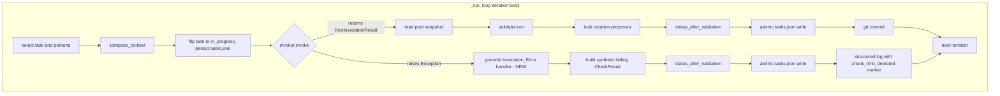

# Design Document

## Overview

This feature adds two small, independent pieces of resiliency to the Ralph Loop so a single oversized-context Kiro CLI failure can no longer kill an entire run:

- **Capability A — Graceful invocation-error handling.** The iteration body in `ralph_loop/cli.py::_run_loop` currently calls `invoker.invoke` inside a `try / except Exception` whose handler sets `exit_code = EXIT_INVOCATION_ERROR` and `break`s out of the loop. The whole process exits. This feature replaces the `break` with a graceful-failure path: catch any `Exception` subclass (but not `KeyboardInterrupt` / `SystemExit`), record a synthetic "iteration failed" outcome through the existing `status_after_validation` rule, persist `tasks.json` atomically, log the exception details with a distinct marker when the captured output mentions the Kiro CLI chunk limit, and continue to the next iteration. Existing retry-cap, termination-decision, and budget rules are untouched, so a task that keeps failing transitions to `stuck` via the same rule any other failure would use.

- **Capability B — Per-file Context_File truncation.** `ralph_loop/context.py::inline_context_files` currently reads every `context_files` entry and inlines its full UTF-8 contents verbatim. This feature adds a configurable per-file byte cap `Config.max_context_file_bytes` (default 65536, i.e. 64 KiB). Files at or under the cap are still inlined verbatim; files over the cap are head-truncated to the cap with a UTF-8-safe boundary adjustment, and a deterministic Truncation_Marker line is appended. Each truncation emits a WARNING-level structured log record. The existing whole-Context_Window truncation in `compose_context` (R6.7, brief summarisation) is unchanged and runs independently of the per-file cap.

The two capabilities are complementary: Capability B removes the most common *cause* of Kiro CLI invocation failures (oversized inlined files), and Capability A ensures that any remaining invocation failure — from context that is still over limit, transient subprocess errors, or any other exception from the Kiro CLI wrapper — degrades to one failed iteration rather than a run-ending crash.

### Motivating real-world failure

During an HCLS book project run, an `expert-review` task declared a 138 KB recipe Markdown file as a `context_files` entry. The Context_Composer inlined it verbatim, Kiro CLI emitted `Separator is not found, and chunk exceed the limit`, the resulting `Exception` propagated out of `KiroInvoker.invoke`, and the iteration loop hit the existing `except Exception: break` path and exited with `EXIT_INVOCATION_ERROR = 4`. One bad task killed 128 unrelated `expert-review` tasks and forced the operator to mark them `stuck` by hand and restart twice. Both capabilities in this spec directly address that failure mode.

### Design constraints

- Python 3.11+, Pydantic v2, `structlog`, `pytest`, Hypothesis.
- No new third-party dependencies.
- `Config` remains additive; existing `ralph.config.json` files must load unchanged.
- No new Task status values, call_kind values, exit codes, or terminal states (R3.1).
- The existing 30 correctness properties from the Ralph Loop design must remain valid.

## Architecture

### Where the new boundaries sit in the loop



Two things to note in the diagram:

1. The new Invocation_Error handler sits **inside** the iteration body. The `for each iteration` control flow resumes at `nextiter` regardless of whether `invoker.invoke` returned cleanly or raised. Today it `break`s out of the loop; the change is to route through `status_after_validation` with a synthetic failing check and then `continue`.

2. When the handler fires, the Validator, the Task Creation Processor, and the Git commit are all **skipped** for that iteration (R1.9). The control-flow edge `H -> synth -> stat2 -> persist2` is deliberately a short path — we never ran the validator, so we have no real validation output to aggregate; we synthesise one failing `CheckResult` and feed it directly into the existing status rule.

### Where the per-file truncation slot fits in the Context_Composer

```mermaid
flowchart TD
    subgraph Compose[compose_context]
        get[spec.context_files] --> inlinefn[inline_context_files]
        inlinefn --> perfile[for each path]
        perfile --> read[read_bytes]
        read --> size{len <= cap?}
        size -- yes --> verbatim[emit verbatim - decode utf-8 errors replace]
        size -- no --> trunc[truncate head to cap - NEW]
        trunc --> boundary[back off to last complete UTF-8 codepoint]
        boundary --> marker[append Truncation_Marker line]
        marker --> warn[structlog WARNING Truncation_Event]
        verbatim --> join[join inlined blocks]
        warn --> join
        join --> assemble[_assemble 7-section window]
        assemble --> overflow{total approx tokens > max_tokens?}
        overflow -- no --> done1[return ContextWindow truncated False]
        overflow -- yes --> briefcut[truncate project brief to BRIEF_SUMMARY_CHARS - existing R6.7]
        briefcut --> reassemble[_assemble again]
        reassemble --> done2[return ContextWindow truncated True]
    end
```



The per-file cap is applied **before** the seven-section assembly and before the R6.7 brief-truncation fallback. The two mechanisms are independent (R2.10): per-file truncation bounds the size of any single Context_File; the whole-window truncation bounds the composed prompt's estimated token count by cutting the project brief. A file truncated by Capability B still counts its retained bytes toward the whole-window token estimate, and the whole-window rule can still fire if many small or moderately-sized Context_Files together blow the `max_context_tokens` budget.

## Components and Interfaces

All paths below are relative to the repository root.

### 1. `ralph_loop/models.py::Config` — add `max_context_file_bytes`

One new field, added in the "Context" group alongside the existing `max_context_tokens` (R6.7):

```python
# Context (R6.7, R2.1-R2.2)
max_context_tokens: int = Field(default=32_000, ge=1)
max_context_file_bytes: int = Field(default=65536, gt=0)
```

- Pydantic v2 `Field(default=65536, gt=0)` gives us a positive-int constraint for free; Pydantic raises `ValidationError` for `0`, negatives, and non-int types (R2.1).
- Default is 65536 bytes (64 KiB) per R2.1–R2.2.
- Because the field has a default, existing `ralph.config.json` files load unchanged (R3.4).

No other model additions. No new task statuses, no new call_kind values, no new exit codes (R3.1).

### 2. `ralph_loop/context.py` — per-file truncation inside `inline_context_files`

Current signature:

```python
def inline_context_files(
    paths: list[str],
    *,
    base_dir: Optional[Path] = None,
) -> tuple[str, list[str]]:
```

New signature (add the cap as a keyword-only argument with a default matching `Config.max_context_file_bytes`):

```python
def inline_context_files(
    paths: list[str],
    *,
    base_dir: Optional[Path] = None,
    max_file_bytes: int = 65536,
) -> tuple[str, list[str]]:
```

Keeping a default on the helper means the function still works for callers that don't pass a `Config` (there is currently only one real caller — `compose_context` — plus a handful of tests). The default matches `Config.max_context_file_bytes` so no behavioural divergence is possible.

`compose_context` passes the cap through. Current signature (context.py):

```python
def compose_context(
    *,
    task: Task,
    spec: TaskSpec,
    persona: Persona,
    brief: str,
    escalation_context: Optional[str] = None,
    resumed_notice: bool = False,
    max_tokens: int = 32_000,
    base_dir: Optional[Path] = None,
) -> ContextWindow: ...
```

New signature:

```python
def compose_context(
    *,
    task: Task,
    spec: TaskSpec,
    persona: Persona,
    brief: str,
    escalation_context: Optional[str] = None,
    resumed_notice: bool = False,
    max_tokens: int = 32_000,
    max_file_bytes: int = 65536,
    base_dir: Optional[Path] = None,
) -> ContextWindow: ...
```

Call-site update in `ralph_loop/cli.py::_run_loop`:

```python
context_window = compose_context(
    task=task,
    spec=spec,
    persona=selection.persona,
    brief=brief,
    resumed_notice=bool(task.resumed_from_interruption),
    max_tokens=config.max_context_tokens,
    max_file_bytes=config.max_context_file_bytes,  # NEW
    base_dir=project_root,
)
```

### 3. Per-file truncation algorithm

The current `inline_context_files` reads each file with `candidate.read_text(encoding="utf-8")`. That is inadequate for byte-cap comparison because `len(str)` counts codepoints, not bytes, and the Kiro CLI chunk limit is measured in bytes. The new algorithm reads as bytes:

```python
TRUNCATION_MARKER_TEMPLATE = (
    "[truncated: {original_bytes} bytes, showing first {cap} bytes]"
)

def _truncate_to_codepoint_boundary(data: bytes, cap: int) -> bytes:
    """Return at most ``cap`` bytes of ``data``, trimmed to a complete UTF-8 codepoint.

    Preconditions: ``cap >= 0`` and ``len(data) > cap`` (callers check).
    Postcondition: returned bytes length in [max(0, cap - 3), cap] and decodes
    as valid UTF-8 under ``errors="strict"``.
    """
    # Start with the raw prefix.
    prefix = data[:cap]
    # UTF-8 continuation bytes match 10xxxxxx (0x80..0xBF). A complete
    # codepoint starts with a byte in one of:
    #   0xxxxxxx  (1-byte ASCII)
    #   110xxxxx  (start of 2-byte seq)
    #   1110xxxx  (start of 3-byte seq)
    #   11110xxx  (start of 4-byte seq)
    # If the last byte of ``prefix`` is a continuation byte, we walk
    # back until we find the start byte of a multi-byte sequence, then
    # drop that partial codepoint entirely. A codepoint is at most 4
    # bytes in UTF-8, so we will rewind at most 3 bytes.
    i = len(prefix)
    while i > 0 and (prefix[i - 1] & 0xC0) == 0x80:
        i -= 1
    # At i - 1 we are now either at a non-continuation byte or i == 0.
    # If i > 0 and the byte at i-1 starts a multi-byte sequence whose
    # complete length would have exceeded ``cap``, drop it.
    if i > 0:
        lead = prefix[i - 1]
        if lead & 0x80:  # top bit set, so multi-byte leader
            if lead & 0xE0 == 0xC0:
                expected_len = 2
            elif lead & 0xF0 == 0xE0:
                expected_len = 3
            elif lead & 0xF8 == 0xF0:
                expected_len = 4
            else:
                # Malformed lead byte; drop it to stay well-formed.
                expected_len = 1
            actual_len = len(prefix) - (i - 1)
            if actual_len < expected_len:
                i -= 1
    return prefix[:i]


def _inline_one_context_file(
    rel_path: str,
    abs_path: Path,
    *,
    max_file_bytes: int,
) -> str:
    """Return the Markdown block for one context file, truncating if needed.

    Emits a structlog WARNING on truncation (Truncation_Event, R2.6).
    """
    data = abs_path.read_bytes()
    original = len(data)
    if original <= max_file_bytes:
        body = data.decode("utf-8", errors="replace")
        return f"### File: {rel_path}\n\n{body}"

    trimmed = _truncate_to_codepoint_boundary(data, max_file_bytes)
    retained = len(trimmed)
    body = trimmed.decode("utf-8", errors="replace")
    marker = TRUNCATION_MARKER_TEMPLATE.format(
        original_bytes=original, cap=max_file_bytes
    )
    # Emit the Truncation_Event so operators can correlate large-file
    # truncations with subsequent validation/invocation outcomes (R2.6, R2.9).
    structlog.get_logger().warning(
        "context_file_truncated",
        path=rel_path,
        original_bytes=original,
        retained_bytes=retained,
        cap_bytes=max_file_bytes,
    )
    # Marker sits on its own line after the body so it is visibly
    # distinct in the composed prompt (R2.7).
    return f"### File: {rel_path}\n\n{body}\n{marker}"
```

Notes on the algorithm:

- We read as `bytes` so `original_bytes` matches the Kiro CLI chunk measurement.
- The UTF-8 boundary rule trims back at most 3 bytes, so the retained output is always in the range `[cap - 3, cap]` bytes and is always valid UTF-8.
- If `max_file_bytes == 0`, the rule above returns `b""` — harmless; the marker still fires because `original > 0`. The Pydantic `gt=0` constraint forbids this from Config, so this case is reachable only through direct calls in tests.
- Decoding is `errors="replace"` to match existing behaviour and so a file with a mid-codepoint split elsewhere (e.g. from a prior manual truncation) still renders without raising.

### 4. `ralph_loop/cli.py::_run_loop` — graceful Invocation_Error handler

The existing iteration body has this shape (simplified, line references to current file):

```python
# Flip to in_progress, persist.
tasks = _set_task_status(tasks, task.id, "in_progress", tasks_path)
pre_snapshot = list(tasks)

# Invoke Kiro CLI.
iter_log_path = log_dir / f"iter-{iteration:04d}.log"
try:
    invocation = await invoker.invoke(
        context=context_window.text,
        log_path=iter_log_path,
        call_kind=(
            "escalation" if selection.path == "escalation"
            else "persona_execution"
        ),
        cwd=project_root,
        model_id=config.default_model_id,
    )
except Exception as exc:  # noqa: BLE001 - subprocess errors
    click.echo(
        f"Kiro CLI invocation failed for task {task.id}: {exc}",
        err=True,
    )
    exit_code = EXIT_INVOCATION_ERROR
    break  # <-- CURRENT behaviour: exit the loop.

# Read post-iteration snapshot, run validator, task creation, status update, git commit...
```

The change replaces the `break` path with a `continue`-after-persist path. Pseudocode:

```python
try:
    invocation = await invoker.invoke(...)
except (KeyboardInterrupt, SystemExit):
    # Never catch: these indicate operator / platform intent to stop.
    raise
except Exception as exc:
    _handle_invocation_error(
        exc=exc,
        task=task,
        persona_name=selection.persona.name,
        tasks=tasks,
        tasks_path=tasks_path,
    )
    tasks = _load_tasks(tasks_path)  # pick up the persisted update
    continue  # R1.3: proceed to the next iteration.
```

The helper lives next to the other per-iteration helpers in `cli.py`:

```python
CHUNK_LIMIT_SUBSTRING = "chunk exceed the limit"


def _handle_invocation_error(
    *,
    exc: Exception,
    task: Task,
    persona_name: str,
    tasks: list[Task],
    tasks_path: Path,
) -> None:
    """Record an Invocation_Error as a synthetic Iteration_Failure (R1.1-R1.9).

    Reuses ``status_after_validation`` by feeding it a synthetic failing
    ``CheckResult`` so the retry-count and status-transition rules stay
    identical to a failed ``persona_review`` (R1.1, R3.2). Persists the
    updated task list atomically before returning (R1.4) so the next
    iteration starts from the persisted state.
    """
    stderr_excerpt = _excerpt(getattr(exc, "stderr", "") or "")
    stdout_excerpt = _excerpt(getattr(exc, "stdout", "") or "")
    combined = " ".join([str(exc), stderr_excerpt, stdout_excerpt]).lower()
    chunk_limit_detected = CHUNK_LIMIT_SUBSTRING in combined

    # Build a synthetic failing CheckResult. The Validator never ran,
    # so we mark the synthetic check with type="shell" + a stable
    # sentinel name so the log row is recognisable. We do NOT invent a
    # new check type so R3.1 ("no new call_kind values, no new Task
    # status values, no new terminal states") holds.
    synthetic = CheckResult(
        type="shell",
        name="kiro_invocation",
        verdict="fail",
        output=f"invocation_error: {type(exc).__name__}: {exc}",
        duration_ms=0,
        timed_out=isinstance(exc, KiroInvocationTimeout),
    )
    new_status, new_retry = status_after_validation(task, [synthetic])

    # Persist atomically BEFORE structured logging so a crash in the
    # logger path cannot lose the status update (R1.4).
    _update_task(
        tasks, task.id,
        {"status": new_status, "retry_count": new_retry},
        tasks_path,
    )

    structlog.get_logger().error(
        "iteration_invocation_error",
        task_id=task.id,
        persona_name=persona_name,
        exception_type=type(exc).__name__,
        exception_message=str(exc),
        stdout_excerpt=stdout_excerpt,
        stderr_excerpt=stderr_excerpt,
        chunk_limit_detected=chunk_limit_detected,
        failure_mode="chunk_limit" if chunk_limit_detected else "generic",
        new_status=new_status,
        new_retry_count=new_retry,
    )


def _excerpt(s: str, limit: int = 2000) -> str:
    """Trim free-form captured output to a bounded excerpt for log records."""
    if not isinstance(s, str):
        s = str(s)
    if len(s) <= limit:
        return s
    return s[:limit] + f"...[truncated {len(s) - limit} chars]"
```

Key design decisions:

- **We reuse `status_after_validation`** rather than writing a parallel function. The existing rule already produces `("failing", retry_count + 1)` when any check fails (R1.1 is satisfied verbatim), and existing tests / properties around the rule remain valid. A parallel function would duplicate the retry-cap semantics and make the invariant in R3.2 (same rules as persona_review failures) easier to break. The synthetic `CheckResult` is the smallest change that routes an Invocation_Error through the existing rule.

- **The synthetic check has `type="shell"`**, not a new type. R3.1 forbids new check types; shell is the simplest existing type whose `CheckResult` fields don't demand per-type extras.

- **We catch any `Exception` subclass**, but `KeyboardInterrupt` and `SystemExit` are not subclasses of `Exception` (they inherit from `BaseException` directly) so the bare `except Exception` above is already correct. We also add an explicit `except (KeyboardInterrupt, SystemExit): raise` to make the guarantee visible in code and to make code-review/diff-readers notice the contract.

- **Persistence ordering.** `_update_task` already uses `atomic_write_bytes` (a tempfile+rename). We call it before the structured log record so a crash between the `_update_task` call and the log line still leaves `tasks.json` consistent.

- **Skip Validator / Task Creation / Git commit.** The `continue` statement at the end of the handler jumps directly to the top of the `while True:` loop, which is before the `validator.run`, `processor.process`, and `git_mgr.iteration_commit` calls. No extra conditional is needed; the control-flow change is simply "don't fall through" (R1.9).

- **Exit code at shutdown.** The handler does not set `exit_code`. At the end of the loop, the termination decision from `termination_decision` and the budget checks govern the returned exit code (R1.6). If a task keeps failing and reaches `Config.max_retries_per_task`, the existing `next_eligible_task` rule excludes it, `termination_decision` eventually reports `blocked` (because every remaining non-passing task is either stuck or has an exhausted retry budget), and the loop exits with `EXIT_BLOCKED`. No new exit code is introduced (R3.1).

### 5. Chunk-limit marker detection

The marker is emitted as both a structured field (`chunk_limit_detected: bool` and `failure_mode: "chunk_limit" | "generic"`) and is implicitly searchable because the event name is a fixed string (`iteration_invocation_error`). Detection works by lower-casing the concatenation of:

1. `str(exc)` — the exception's message,
2. `exc.stderr` if the attribute exists,
3. `exc.stdout` if the attribute exists,

and testing for the literal substring `chunk exceed the limit` (case-insensitive). This matches the exact string Kiro CLI emitted in the motivating failure (`Separator is not found, and chunk exceed the limit`) and does not require Kiro CLI to change its error shape.

The recommendation (see §Risks/Open Questions) is to prefer the structured key (`failure_mode="chunk_limit"`) over a substring in the human-readable message. Structured keys are filterable in the JSON log pipeline (`structlog` renders a JSON object per event, R11.5) and never drift under message rewording.

## Data Models

### Config

One additive field only:

```python
# Appended to the existing "Context" group in Config.
max_context_file_bytes: int = Field(default=65536, gt=0)
```

Validation:

- Pydantic v2 `gt=0` rejects `0` and negative values with a standard `ValidationError`.
- Type is `int`, so strings and floats raise the usual Pydantic coercion error.
- Default 65536 applies when the field is absent from `ralph.config.json` (R2.2, R3.4).

### No new models

There are **no** other model changes:

- **No new Task status values.** The synthetic `CheckResult` feeds the existing rule and the task transitions to `failing` / `stuck` through existing code paths.
- **No new `CallKind` values.** The handler records an error log line with fields, not an `LlmCallRecord`, so the token accountant and the iteration log schema stay the same.
- **No new `CheckType` values.** The synthetic `CheckResult` uses the existing `type="shell"`.
- **No new exit codes.** `EXIT_INVOCATION_ERROR` (4) is now reached only through the outer `try / except` in the `run` CLI command that still covers config / startup crashes and unhandled interpreter-level exceptions. The per-iteration path no longer sets it.
- **No new `TaskCreationResult` / `ValidationResult` fields.**

Reviewers can check this by diffing `ralph_loop/models.py`: the only diff is the one new `Config` field.

<!-- prework-anchor -->

## Correctness Properties

*A property is a characteristic or behavior that should hold true across all valid executions of a system — essentially, a formal statement about what the system should do. Properties serve as the bridge between human-readable specifications and machine-verifiable correctness guarantees.*

This feature preserves the existing 30 correctness properties from `.kiro/specs/ralph-loop/design.md` (Properties 1–30) and the verdict-parsing bugfix properties (Properties 17–19 in `.kiro/specs/persona-review-verdict-parsing/design.md`). Every property listed there continues to hold byte-for-byte: neither the retry-counting rule (Property 2), the termination decision (Properties 1, 23), the validator aggregation (Property 13), the context composition invariants (Properties 9, 10), nor the task-creation diff rules (Properties 16, 17, 18, 19) is touched by this change.

New properties introduced by this feature begin at 20, continuing from Property 19 (verdict-parsing preservation).

### Property 20: Invocation_Error converges to Iteration_Failure via the same rule as a failing check

*For any* task state `T: Task` (with any `retry_count` and any non-terminal `status`) and *for any* exception instance `E: Exception` raised out of `invoker.invoke`, the `(new_status, new_retry)` pair that `_handle_invocation_error` persists equals exactly the pair that `status_after_validation(T, [synth])` produces, where `synth` is any `CheckResult` with `verdict="fail"`. Equivalently: the handler never invents a new transition rule; it routes through the existing pure function that already governs persona_review failures.

**Oracle**: `status_after_validation` itself. The property strategy generates a random `Task` plus a random exception (chosen from `RuntimeError`, `subprocess.CalledProcessError`, `KiroInvocationTimeout`, and a bare `Exception`), invokes the handler against a fake `tasks_path` (via a tempdir) so the atomic write happens and can be read back, then asserts the persisted `(status, retry_count)` equals the oracle output.

**Hypothesis strategy sketch**:

```python
@st.composite
def task_and_exception(draw):
    task = draw(
        st.builds(
            Task,
            id=st.text(min_size=1, max_size=8),
            title=st.text(min_size=1, max_size=16),
            priority=st.integers(min_value=0, max_value=10),
            status=st.sampled_from(["pending", "failing", "in_progress"]),
            spec_path=st.just("specs/x.md"),
            retry_count=st.integers(min_value=0, max_value=10),
        )
    )
    exc_cls = draw(st.sampled_from([
        RuntimeError, ValueError, KiroInvocationTimeout,
        subprocess.CalledProcessError,
    ]))
    msg = draw(st.text(max_size=200))
    stderr = draw(st.text(max_size=200))
    stdout = draw(st.text(max_size=200))
    ...
    return task, exc

@given(task_and_exception())
def test_handler_matches_status_after_validation(pair):
    task, exc = pair
    oracle_status, oracle_retry = status_after_validation(
        task, [CheckResult(type="shell", name="x", verdict="fail", output="", duration_ms=0)]
    )
    _handle_invocation_error(exc=exc, task=task, persona_name="P",
                             tasks=[task], tasks_path=tmp_tasks)
    reloaded = _load_tasks(tmp_tasks)[0]
    assert reloaded.status == oracle_status
    assert reloaded.retry_count == oracle_retry
```

**Validates: Requirements 1.1, 1.5, 3.2, 3.3**

### Property 21: Truncation is idempotent and byte-bounded

*For any* `data: bytes` and *for any* `cap: int > 0`, let `retained = _truncate_to_codepoint_boundary(data, cap)`. Then:

1. `len(retained) in [max(0, cap - 3), cap]` — UTF-8 codepoints are at most 4 bytes wide, so the boundary rewind drops at most 3 bytes.
2. `retained.decode("utf-8", errors="strict")` succeeds — no partial codepoints remain.
3. `_truncate_to_codepoint_boundary(retained, cap) == retained` — running the function again on output already at or below the cap is a no-op (idempotence).

**Oracle**: built from the three predicates above. No separate reference implementation needed.

**Hypothesis strategy sketch**:

```python
@given(st.binary(min_size=0, max_size=2048),
       st.integers(min_value=1, max_value=1024))
def test_truncate_byte_bounded_and_idempotent(data, cap):
    retained = _truncate_to_codepoint_boundary(data, cap)
    # 1. byte bounds
    assert 0 <= len(retained) <= cap
    if len(data) > cap:
        assert len(retained) >= cap - 3
    else:
        assert retained == data
    # 2. valid UTF-8 (no partial codepoint)
    retained.decode("utf-8")  # errors="strict" by default
    # 3. idempotence
    assert _truncate_to_codepoint_boundary(retained, cap) == retained
```

**Validates: Requirements 2.3, 2.4, 2.8**

### Property 22: Truncation marker invariant

*For any* file whose original UTF-8 encoded byte size `N` exceeds the configured `cap`, the Markdown block emitted by `_inline_one_context_file` ends with the Truncation_Marker on its own line, and the marker's literal text matches the template with `N` and `cap` substituted. *For any* file whose size is `<= cap`, the emitted block contains no Truncation_Marker substring.

Formally, with `TRUNCATION_MARKER_REGEX = r"\n\[truncated: (\d+) bytes, showing first (\d+) bytes\]\Z"`:

- If `N > cap`: `re.search(TRUNCATION_MARKER_REGEX, block)` returns a match whose captured groups are `(str(N), str(cap))`.
- If `N <= cap`: `"[truncated:"` is absent from `block`.

**Oracle**: regex match against the template defined in `TRUNCATION_MARKER_TEMPLATE`. The property test generates a random byte payload, writes it to a tempfile, calls `_inline_one_context_file`, and checks the regex holds in both directions.

**Hypothesis strategy sketch**:

```python
@given(st.binary(min_size=0, max_size=4096),
       st.integers(min_value=1, max_value=512))
def test_marker_invariant(data, cap):
    path = tmp_path / "ctx.md"
    path.write_bytes(data)
    block = _inline_one_context_file("ctx.md", path, max_file_bytes=cap)
    n = len(data)
    if n > cap:
        m = re.search(TRUNCATION_MARKER_REGEX, block)
        assert m is not None
        assert int(m.group(1)) == n
        assert int(m.group(2)) == cap
    else:
        assert "[truncated:" not in block
```

**Validates: Requirements 2.4, 2.5, 2.7**

### Property 23: Config field is additive with default 65536

*For any* valid existing `ralph.config.json` (any combination of currently-defined fields, omitting `max_context_file_bytes`), `Config.model_validate(dict)` succeeds and the resulting `Config` has `max_context_file_bytes == 65536`. *For any* dict that provides `max_context_file_bytes` as a positive int `v`, the resulting `Config` has `max_context_file_bytes == v`. *For any* dict that provides `max_context_file_bytes` as a non-positive int or a non-int, `Config.model_validate` raises `ValidationError`.

**Oracle**: the default value `65536` and the identity function on valid inputs; `ValidationError` on invalid inputs.

**Hypothesis strategy sketch**:

```python
# Generator for an existing valid config dict without the new field:
existing_config = st.fixed_dictionaries({
    "fallback_persona": st.text(min_size=1, max_size=16),
    "max_iterations": st.integers(min_value=1, max_value=1000),
    # ... rest of Config fields at their documented ranges ...
})

@given(existing_config)
def test_field_absent_uses_default(cfg):
    c = Config.model_validate(cfg)
    assert c.max_context_file_bytes == 65536

@given(existing_config, st.integers(min_value=1, max_value=10 * 1024 * 1024))
def test_field_present_roundtrips(cfg, v):
    cfg = {**cfg, "max_context_file_bytes": v}
    assert Config.model_validate(cfg).max_context_file_bytes == v

@given(existing_config, st.integers(max_value=0))
def test_field_rejects_non_positive(cfg, v):
    cfg = {**cfg, "max_context_file_bytes": v}
    with pytest.raises(ValidationError):
        Config.model_validate(cfg)
```

**Validates: Requirements 2.1, 2.2, 3.4**

### Property 24: Loop exit code is termination-decision-driven, not Invocation_Error-driven

*For any* scripted sequence of per-iteration outcomes — a mix of Invocation_Errors (handler fires), passing iterations (validator returns `overall="pass"`), failing iterations (validator returns `overall="fail"`), and retry-cap transitions — the final exit code returned by `_run_loop` equals `termination_decision(final_tasks).exit_code` (or the appropriate budget-exceeded code if a budget triggered exit first). The exit code is never set to `EXIT_INVOCATION_ERROR` from within the per-iteration body.

**Oracle**: `termination_decision(final_tasks).exit_code` combined with `BudgetTracker`'s wall-clock and iteration-count checks. The exit-code rule from the existing `_run_loop` is reused unchanged; the property asserts that it *alone* decides the final code.

**Test approach**: this is a state-machine invariant over the loop, not a pure function, so it is exercised by a **targeted unit harness** rather than a direct Hypothesis run. The harness constructs a minimal in-memory `_run_loop` driver with stub `KiroInvoker`, stub `Validator`, and stub `Orchestrator`, then scripts small sequences (2–4 tasks, 2–6 iterations) covering: (a) all-pass, (b) mix of handler fires + passes, (c) retry-cap exhaustion after repeated handler fires, (d) handler fire followed by a passing iteration on a different task. For each scenario, assert the returned exit code equals the oracle. Hypothesis-style random generation can layer on top once the harness is in place, but the baseline coverage is enumerable with hand-written scenarios.

**Validates: Requirements 1.3, 1.6, 3.1**

### Property reflection

Five new properties were considered and consolidated into four numbered ones plus Property 24 as a unit-harness invariant:

- Acceptance criteria 1.1, 1.5, 3.2, 3.3 consolidate into Property 20 (single oracle-equality statement covers all of them).
- Acceptance criteria 2.3, 2.4, 2.5, 2.7, 2.8 split into two independent properties, 21 (length + UTF-8 well-formedness + idempotence) and 22 (marker template), because their oracles are genuinely different (numeric predicates vs regex match).
- Acceptance criteria 2.1, 2.2, 3.4 consolidate into Property 23.
- Acceptance criterion 1.6 is covered by Property 24 alone; it cannot be merged into Property 20 because Property 20 is a per-call invariant while Property 24 is a full-loop state-machine invariant.
- Acceptance criteria 1.7 (chunk-limit substring detection) is testable but does not earn a dedicated numbered property: the detection function is a single-line pure-string predicate, and its universal statement is "for all `s: str`, `CHUNK_LIMIT_SUBSTRING in s.lower()` iff the marker is present". That's trivially verified by a handful of unit tests (case variants, source-slot variants) rather than a PBT.

## Error Handling

The handler in `cli.py::_run_loop` catches every `Exception` subclass raised out of `invoker.invoke`. It does **not** catch `BaseException` subclasses that live outside `Exception` — specifically, `KeyboardInterrupt` and `SystemExit` continue to propagate up to the top-level `try` in `cli.py::run`, which already handles cleanup and writes the traceback to `logs/crash.log`.

Classification of caught exceptions into failure modes:

| Exception class                         | Captured output contains `chunk exceed the limit`? | `failure_mode` | `timed_out` on synthetic CheckResult | Notes                                                                |
|-----------------------------------------|-----------------------------------------------------|----------------|--------------------------------------|----------------------------------------------------------------------|
| `KiroInvocationTimeout`                 | n/a (timeout is a distinct signal)                  | `"generic"`    | `True`                               | Handler path is the same, but the synthetic check records `timed_out=True` so downstream analysis can split "timed out" from "other invocation errors" via the synthetic log row. |
| `subprocess.CalledProcessError`         | yes                                                 | `"chunk_limit"`| `False`                              | `exc.stderr` / `exc.stdout` are set on `CalledProcessError`; the detection rule concatenates all three sources. |
| `subprocess.CalledProcessError`         | no                                                  | `"generic"`    | `False`                              |                                                                      |
| `RuntimeError` (bare)                   | yes                                                 | `"chunk_limit"`| `False`                              | The Kiro CLI wrapper raises plain `RuntimeError` for malformed subprocess output; detection works off `str(exc)` alone. |
| `RuntimeError` (bare)                   | no                                                  | `"generic"`    | `False`                              |                                                                      |
| Any other `Exception` subclass          | yes                                                 | `"chunk_limit"`| `False`                              |                                                                      |
| Any other `Exception` subclass          | no                                                  | `"generic"`    | `False`                              |                                                                      |
| `KeyboardInterrupt`                     | n/a                                                 | **NOT CAUGHT** | n/a                                  | Re-raised; the outer `except KeyboardInterrupt` in `run` writes a friendly message and exits with `EXIT_INVOCATION_ERROR` (existing behaviour, R13.5 unchanged). |
| `SystemExit`                            | n/a                                                 | **NOT CAUGHT** | n/a                                  | Re-raised; allows operator `sys.exit(...)` calls and pytest teardown to work.                             |

The handler also guards `_update_task` against a silent failure: `_update_task` is the same helper used by every other per-iteration status transition (and already uses `atomic_write_bytes`), so any filesystem error raised from it propagates up to the top-level `except` in `run`, where the traceback is written to `logs/crash.log`. The handler deliberately does not catch errors from `_update_task`: losing a status update is worse than crashing, because an in-progress task would silently stay `in_progress` across runs.

Logs emitted by the handler always include every key in the schema described in §4, even when a source attribute is missing on the exception. For an exception class without `stdout` / `stderr`, the `_excerpt` helper returns `""` and the structured log record records `stdout_excerpt=""` / `stderr_excerpt=""`. Downstream tooling (R11.5 JSON log pipeline) can rely on a stable key set.

## Testing Strategy

**Dual approach** (matches the existing ralph-loop testing strategy):

- **Unit tests** for pure helpers and for the handler's observable side-effects.
- **Property-based tests** for universal invariants (Properties 20–23; Property 24 via a unit harness).
- **Integration test** for the full loop's graceful-continue path, exercising the handler end-to-end through a stub invoker.

### Unit tests

**`_truncate_to_codepoint_boundary`** (pure function):

- `cap == 0` returns `b""` for any input.
- `cap >= len(data)` returns `data` unchanged.
- Boundary rewind: ASCII payload of length `cap + 5` truncates to exactly `cap`.
- 2-byte codepoint (`"é"`, `0xC3 0xA9`) with cut inside: rewinds 1 byte.
- 3-byte codepoint (`"€"`, `0xE2 0x82 0xAC`) with cut inside: rewinds 1 or 2 bytes depending on position.
- 4-byte codepoint (`"🎉"`, `0xF0 0x9F 0x8E 0x89`) with cut inside: rewinds up to 3 bytes.
- Pure-ASCII input: no rewind ever occurs; `len(retained) == cap`.
- Pure-multi-byte input: each truncation lands exactly on a codepoint boundary.
- Malformed input (continuation byte at position 0): returns empty bytes.

**`_inline_one_context_file`**:

- File smaller than cap: emitted block is `"### File: <rel_path>\n\n<contents>"` with no marker.
- File at exactly cap: same as above (boundary is inclusive per the `<=` check).
- File larger than cap: emitted block ends with `\n[truncated: N bytes, showing first CAP bytes]` where `N == original_size` and `CAP == max_file_bytes`.
- Marker format: matches `TRUNCATION_MARKER_REGEX` exactly; the marker is on its own line (preceded by `\n`).
- WARNING log emitted with `event="context_file_truncated"` and keys `path`, `original_bytes`, `retained_bytes`, `cap_bytes` — captured via `structlog.testing.capture_logs`.

**`_handle_invocation_error`**:

- Chunk-limit detected in `str(exc)` only: `failure_mode == "chunk_limit"`, `chunk_limit_detected == True`.
- Chunk-limit detected in `exc.stderr` only: same.
- Chunk-limit detected in `exc.stdout` only: same.
- Chunk-limit detected in uppercase (`"CHUNK EXCEED THE LIMIT"`): same (case-insensitive).
- No chunk-limit marker: `failure_mode == "generic"`, `chunk_limit_detected == False`.
- `KiroInvocationTimeout` instance: synthetic `CheckResult.timed_out == True`; all other fields present.
- `RuntimeError` with no `stdout` / `stderr` attributes: `stdout_excerpt == ""`, `stderr_excerpt == ""` (no `AttributeError`).
- Persistence ordering: inject a structlog processor that raises on first call; assert `tasks.json` on disk still reflects the new status/retry.
- `_update_task` call side-effect: after the handler, `_load_tasks(tasks_path)` returns the task with `status="failing"` and `retry_count` incremented by 1.
- Excerpt helper: strings under 2000 chars round-trip unchanged; strings over 2000 chars are truncated with the documented `"...[truncated N chars]"` suffix.

### Integration test — full-loop graceful-continue

One integration test walks the full `_run_loop` path with a stubbed `KiroInvoker`:

```text
Setup:
  tasks.json with three tasks A, B, C (all status=pending, priority=1)
  stub invoker:
    - task A first invocation: raise RuntimeError("chunk exceed the limit")
    - task B first invocation: return KiroInvocationResult(exit_code=0, ...)
    - task C first invocation: return KiroInvocationResult(exit_code=0, ...)
  stub validator:
    - for B and C: return ValidationResult(overall="pass", ...)
Assertions:
  - _run_loop returns EXIT_SUCCESS (all non-A tasks passing, A is failing with retry_count=1)
  - OR, if the test runs long enough for A to exhaust retries, EXIT_BLOCKED
  - tasks.json end state: A.status == "failing", A.retry_count == 1,
    B.status == "passing", C.status == "passing"
  - Handler logs recorded: exactly one "iteration_invocation_error" event
    with chunk_limit_detected=True, task_id="A", failure_mode="chunk_limit"
  - Invoker call count on A == 1 (no same-iteration retry)
  - Validator call count on A == 0 (Validator skipped, R1.9)
  - Git manager call count for A's iteration == 0 (commit skipped, R1.9)
```

### Property-based tests

Properties 20–23 are implemented as Hypothesis tests following the sketches above, each configured with `max_examples=200` and the Feature/Property tag format used elsewhere in the repo:

```python
# Feature: resilient-invocation-and-context-truncation, Property 21:
# Truncation is idempotent and byte-bounded with valid UTF-8 output.
@given(data=st.binary(max_size=2048),
       cap=st.integers(min_value=1, max_value=1024))
@settings(max_examples=200)
def test_property_21_truncate_bounded_and_idempotent(data, cap):
    ...
```

Property 24 is implemented as a scripted unit harness rather than a pure Hypothesis test. The harness lives in `tests/test_cli_invocation_error_handler.py` and enumerates a small fixed set of iteration scenarios; it can be promoted to a Hypothesis `@composite` strategy in a follow-on task if enumeration coverage proves insufficient.

### Regression gate

All 516 currently-passing tests must continue to pass with the changes applied. The CI run is the primary regression guard; the feature is not considered done until:

- `pytest` exits with 0.
- `pytest --collect-only | wc -l` shows at least 516 + N tests, where N is the count of new tests added by this feature.
- Coverage for `ralph_loop/cli.py::_handle_invocation_error` and `ralph_loop/context.py::_truncate_to_codepoint_boundary` / `_inline_one_context_file` is 100% line and branch.

## Risks and Open Questions

### Chunk-limit substring detection is fragile to Kiro CLI wording changes

The string `chunk exceed the limit` comes from the Kiro CLI's own error output and could change without notice. If Kiro CLI rewords this to, say, `chunk size exceeds limit` or `input too long`, the detection rule would silently fall back to `failure_mode="generic"` and operators would lose the chunk-limit signal. Mitigations in the current design:

- The structured log event always includes `exception_message`, `stdout_excerpt`, and `stderr_excerpt`, so the raw text is available for post-hoc rule updates.
- `failure_mode` is emitted as a structured key, not a substring in a formatted message, so downstream analytics filter on the key — any wording change only needs one regex update, not a log-pipeline rewrite (R11.5 JSON log pipeline).
- A unit test uses the real failing output captured from the HCLS run as a fixture, so a literal change to the Kiro CLI error wording breaks the test rather than silently degrading detection.

Follow-on work could add a structured error channel from Kiro CLI (stdin/stdout envelope with a typed `error_kind` field), eliminating the substring match entirely.

### 64 KiB default may still be too large for some model/prompt combinations

The Kiro CLI chunk limit is not a fixed value; it depends on the model and the rest of the prompt's size (loop framing, persona prompt, task spec). A 64 KiB file plus a moderately large task spec and persona prompt may still overflow for certain models. Mitigations:

- The default is documented and user-configurable via `Config.max_context_file_bytes`.
- Capability A catches whatever invocation errors slip past Capability B, so an undersized cap never produces a run-ending crash.

Follow-on work could auto-tune the cap based on observed invocation-error rates: if a run hits `failure_mode="chunk_limit"` more than N times, reduce the cap by a multiplicative factor for subsequent iterations.

### Head-only truncation loses the end of the file

For some task types — expert-review against a recipe checklist that lives at the bottom of the file, a long changelog whose newest entries matter most — dropping the tail is actively harmful. Mitigations in the current design:

- The Truncation_Marker explicitly records the original and retained byte counts, so the persona sees that content was dropped and can prompt the user / escalate (though this requires persona-side awareness).
- Operators can raise `max_context_file_bytes` for runs that rely on tail content.

Follow-on work (out of scope for this spec):

- Head + tail truncation: keep the first `cap / 2` bytes and the last `cap / 2` bytes with a middle marker.
- Summarisation: for files over a much larger cap (say 1 MB), run a preliminary LLM call to extract a summary.
- Token-aware slicing: use the target model's tokenizer to compute a cap in tokens rather than bytes.

### `_update_task` and the caller's stale `tasks` reference

`_update_task` mutates `tasks.json` on disk and returns the new in-memory list. The caller's `tasks` local variable inside `_run_loop` is a reference to the pre-update list and is stale after the handler returns. The pseudocode handles this explicitly by calling `_load_tasks(tasks_path)` immediately after `_handle_invocation_error` returns; this must remain in the final implementation and must be covered by a test that asserts the post-handler `tasks` list reflects the persisted change.

The design documents this contract in two places: the pseudocode in §4 and this section. The alternative — having the handler mutate a caller-provided list in place — would couple the handler to the caller's data structure and make the unit test harness harder to write. The explicit reload is preferred.

### The synthetic CheckResult's `type="shell"` may surprise iteration-log consumers

The synthetic `CheckResult` appears in logs with `type="shell"` and `name="kiro_invocation"`. Log consumers that filter by `type="shell"` and expect the output to be a real shell command's stdout may see `invocation_error: RuntimeError: ...` and be confused. Mitigation: the `name="kiro_invocation"` sentinel is a stable, searchable marker that distinguishes these synthetic rows from real shell checks. The design's "No new models" bullet in §Data Models calls this trade-off out so reviewers see it.

Follow-on work: add a synthetic log-only `CheckType` (e.g. `"invocation_error"`) to `models.py` if the confusion proves real. That change would touch `CheckType` and therefore trigger R3.1 ("no new check types"), so it is deliberately out of scope for this spec.
